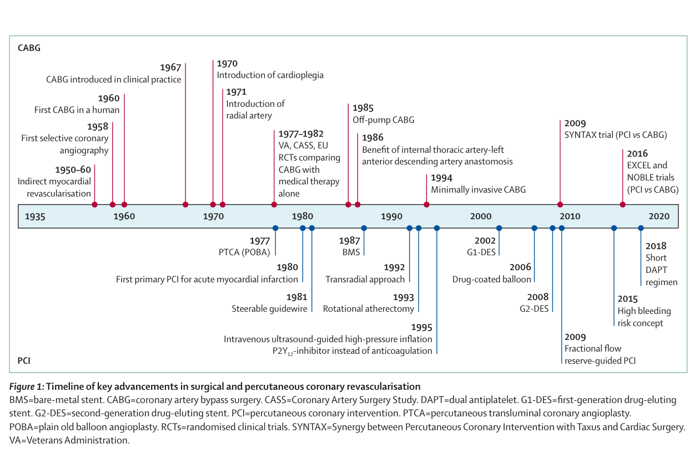
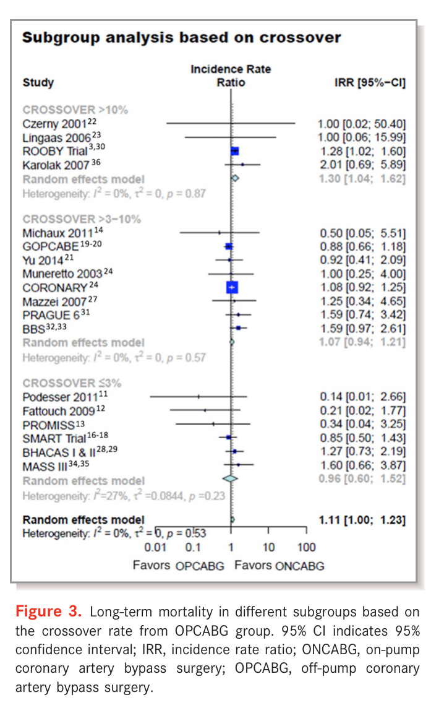
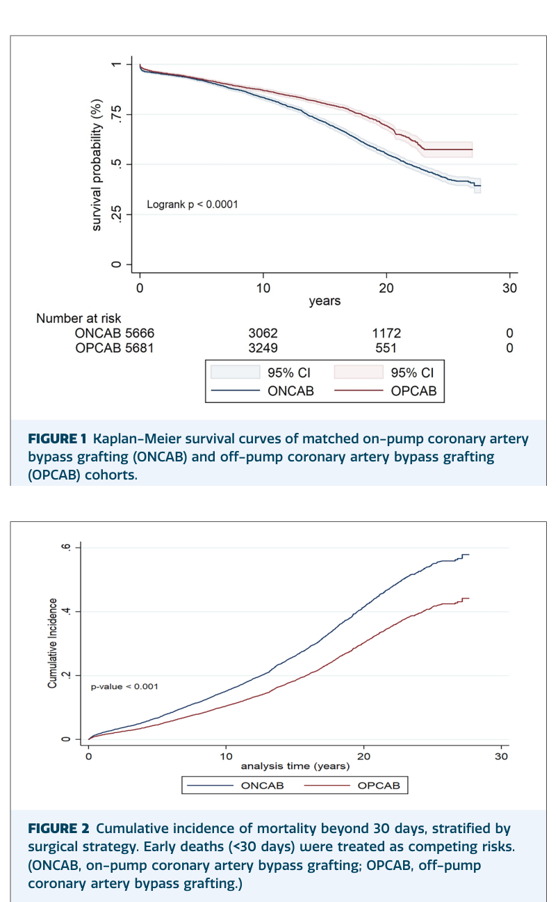
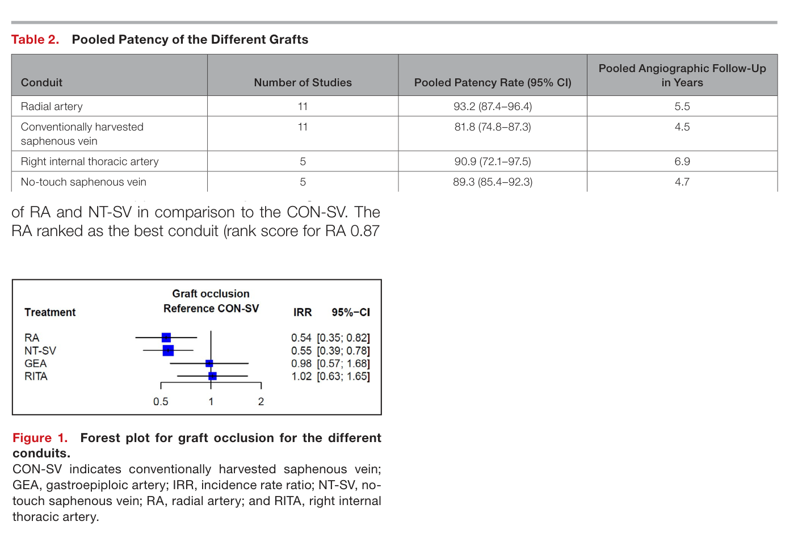
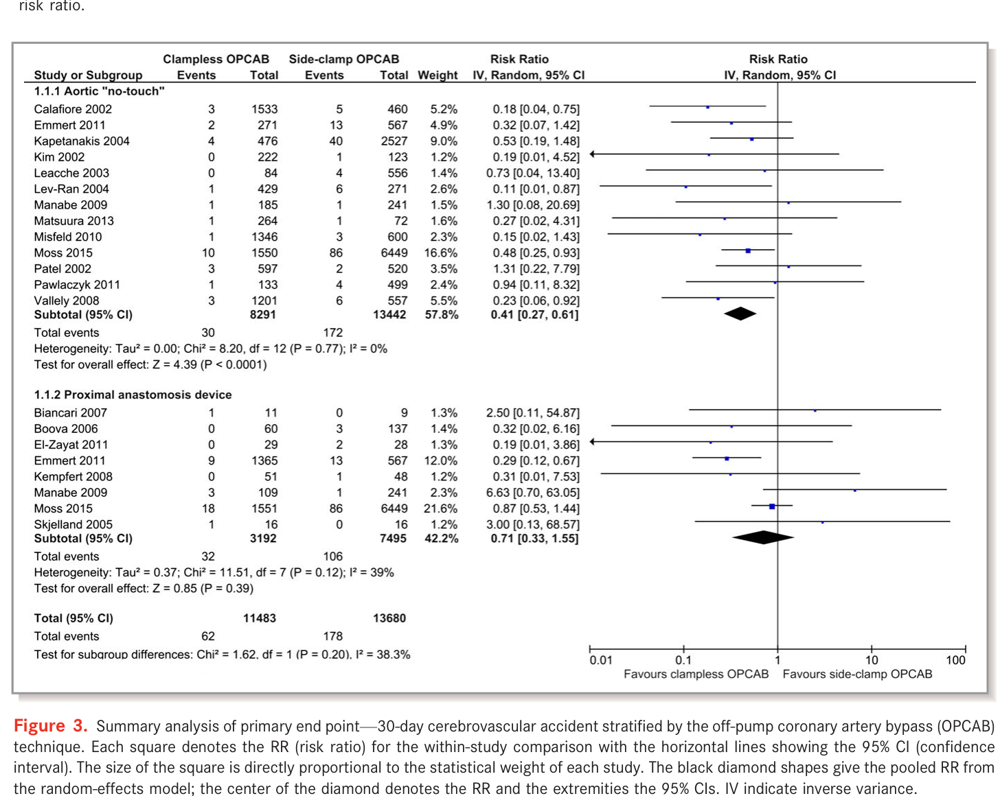
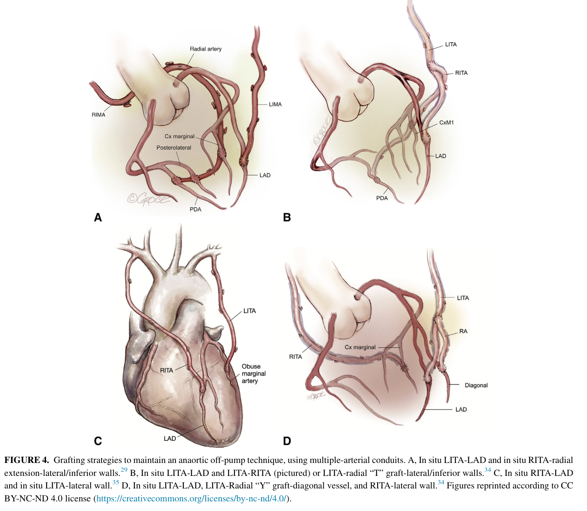
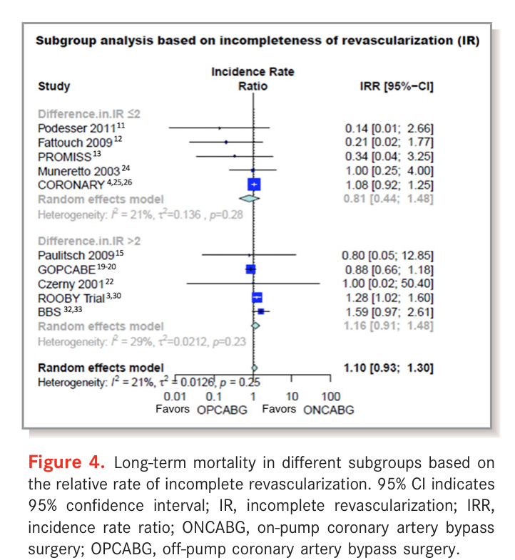
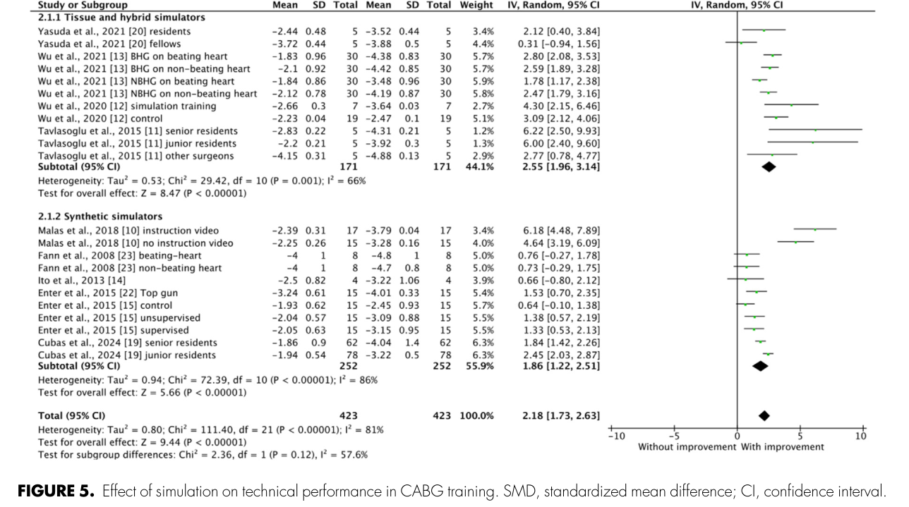

# 冠動脈バイパス術（CABG）統合レビュー — オフポンプ／オンポンプ論争を軸に

**作成日:** 2026-07-26
**一次文献:** 52編（全編フルテキストPDFを精読。`cabg_evidence/pdf/`）
**母集団:** PubMed 66クエリ・3,112レコードから領域網羅で選抜（`CABG_evidence_reading_list_2026-07.md` に265編の全リスト）

---

## この文書の位置づけと、扱いに注意を要する3つの数字

本レビューは、ある学会発表の聴講メモを起点に「CABGの最新エビデンス」を一次文献で再構成したものである。起点となったメモには3つの発表が引用されていたため、まずその照合結果を示す。**この作業は本レビュー全体の信頼性の基準を定めるものなので、最初に置く。**

### 照合1（一致）— Raja の25年コホート

メモの「25年生存率がオフポンプ57%、オンポンプ42%」は実在し、数値も一致する。**Raja SG ら, Ann Thorac Surg Short Rep 2026（PMID 42266971）**。13,626例（OPCAB 7,408／ONCAB 6,218）を傾向スコアマッチングして11,368例（各5,684）、25年生存は未調整 58.2% vs 42.2%、**マッチ後 57.5% vs 42.7%（いずれも P<.001）**、OPCAB は独立して生存に寄与（**HR 0.625, 95%CI 0.574–0.664**）。

### 照合2（論文として存在しない）— Lamy の3試験統合

メモの「ROOBY・CORONARY・GOPCABE の約1万例を統合し、30日・5年で有意差なし」について、**この3試験を1本にまとめた Lamy 名義の統合解析は PubMed に存在しない**。各試験の30日・1年・5年成績はすべて公刊されており本レビューの§2で個別に扱うが、「統合解析」として引用することはできない。学会発表段階と考えられる。同趣旨を担う既刊のメタ解析は §3 に収録した。

### 照合3（存在せず、かつ公刊データは逆向き）— Puskas の「STS 184,550ペア・15年生存が完全同一」

**この解析は PubMed に見当たらない**（Puskas 氏の近著、STSデータベース系、Medicare連結系を個別に検索済み）。そして重要なのは、**現時点で公刊されている最大の同種解析は逆の結論を出している**ことである。

**Squiers JJ ら, Ann Thorac Surg 2022（PMID 34411544）**は Medicare の **1,235,089例**（OPCAB 209,085／ONCAB 1,026,004）を解析し、IPTW 後も OPCAB が長期死亡で不利であった（**生存中央値 9.8年 vs 10.2年、差 −134日、log-rank P<.001**）。ただし術者症例数との交互作用があり、高volume術者では差が縮小する。Calafiore ら（PMID 38941506）が同データを引用した記述では、100例以上の経験を持つ術者に限っても OPCAB の10年死亡は **HR 1.11（95%CI 1.04–1.18）**、再血行再建は HR 1.17（1.1–1.37）、脳卒中は同等、そして off-pump 嗜好が90%以上の術者群では **HR 1.36（95%CI 1.04–1.78）**とされる。

> **したがって「15年生存は完全に同一」は、公刊エビデンスではまだ裏が取れていない主張である。** 引用する場合は Squiers 2022 と、経験豊富な術者に限定した Chikwe ら（JACC 2018, PMID 30236310）を必ず併記すべきである。なお本文書では Squiers・Chikwe の本文PDFが入手できていないため、両者については**抄録に記載された数値のみ**を用いており、該当箇所で明示する。

一方で、メモが述べていた**「長期成績は血行再建の完全性と多枝動脈グラフト（MAG）の採用に依存する」という構造そのものは、別々の論文で裏付けがある**（§8・§5）。メモの骨格は妥当で、個々の帰属先に誤りがある、というのが照合の総括である。

---

## §1. 史的背景 — 狭心症手術の120年とCABGの60年

### 1-1. 直接バイパス以前 — 間接的血流増加の時代

冠動脈疾患に対する外科治療の提案は **1899年の François Franck による交感神経切除**に遡る。以後半世紀、外科は「心筋への血流を間接的に増やす」試みを繰り返した。心膜癒着形成（1935年 Beck）、胸筋・大網・空腸の心表面への縫着（1935–1937年 Beck／O'Shaugnessy／Lezius）、そして最も広く行われた **Vineberg 手術**（内胸動脈を心筋トンネルに埋め込み側副路の発達を待つ）である。Vineberg 手術は最大95%の患者で狭心症を軽減したと報告されたが、内胸動脈床からの側副路は細く、シャム対照試験で内胸動脈結紮の無効が示されると、これらは「症状は消えるが機序は説明できない」手術群として整理された。

1954年に **Murray** が「直接吻合が必要になる」と予言し、同時期にタンタルリングをコネクタとする吻合法が試みられた。転機は診断側から来た。**1958年 Mason Sones による選択的冠動脈造影**（PMID 38919214 に経緯）が、初めて「どこが詰まっているか」を術前に示したのである。

### 1-2. 1964–1967年 — 直接バイパスの成立

**1964年2月25日、Vasilii Kolesov** が内胸動脈–左前下行枝（LAD）の縫合吻合を行った。体外循環を用いない、拍動下の吻合であった。同時期、**René Favaloro** が Cleveland Clinic で伏在静脈グラフトを系統化し、1967年に American Association for Thoracic Surgery で報告する。Favaloro 自身の回顧（**PMID 9714098**）は、患者を選べば死亡率を下げられると確信するに至る過程、左主幹部病変での死亡率が極端に高かった事実、パッチ再建が乱流と血栓症を招いた失敗までを含めて記述しており、一次資料として読む価値がある。1971年の報告では18例の切迫心筋梗塞と11例の急性心筋梗塞に対する手術死亡率5.4%、うち50%は内胸動脈埋め込みを併用していた。

**ここで確認しておくべき事実がある。CABGの起点は拍動下手術（beating heart）であった。** 体外循環と心停止は、より複雑な多枝再建を安全に行うための後発技術である。1970年代のカリウム心停止液、1980年代の血液心筋保護液が確立して初めて、「心臓を止めて縫う」ことが標準となった。したがって後述するオフポンプの1990年代の再興は、新技術の登場ではなく**原点への回帰**として理解するのが正確である。

### 1-3. 普及、そして内科治療・PCIとの競合

米国のCABG件数は1974年に3–4万件、1976年に6万件を超え、1983年には年19.1万件に達した（Head, **PMID 24086085**）。CABG が内科治療に優る根拠は7試験のメタ解析で示され、生存利益は**5年 OR 0.61（95%CI 0.48–0.77）、7年 OR 0.68（0.56–0.83）、10年 OR 0.83（0.70–0.98）**であった。MASS-II では5年の狭心症なし生存が内科治療54.8% vs CABG 74.2%（P<0.001）。

その後 PCI が急性心筋梗塞から安定多枝病変へ適応を広げ、CABG は複雑病変に集約されていく。件数の国際差は極端で、人口10万対の年間CABG件数は現代西欧圏の平均62.2件に対して国間で462%の開きがあり、虚血性心疾患死亡あたりの件数比では817%の開きがある。この「同じ疾患に対する治療密度の桁違いの差」は、以後のすべての比較研究に選択バイアスとして影を落とす。

***図1.*** 冠動脈血行再建の主要マイルストーン年表（上段=外科／下段=PCI）。**1985年に off-pump CABG** が置かれ、1967年 CABG臨床導入、1970年 心筋保護液導入、1971年 橈骨動脈導入が読み取れる。§1-2 で述べた「起点は拍動下手術」という順序は、1960年の First CABG in a human と1970年の cardioplegia の位置関係に対応する。

*出典: Gaudino M, et al. *Lancet* 2023;401:1611–28（PMID 37121245, CC BY 4.0）Figure 1*

### 1-4. オフポンプの隆盛と幻滅 — 30年の論争史

1990年代、Benetti・Buffolo・Calafiore らが小切開・拍動下手術を再導入する（Calafiore の LAST: 左前小開胸）。メカニカルスタビライザの登場で側壁・下壁の露出が可能になり、2001年には米国CABGの25%がオフポンプとなった。しかし2000年代のRCT群が「期待された生存利益を示せない」と受け取られると急速に退潮する。

この30年の力学を最もよく叙述しているのが **Gaudino らの「Off-Pump CABG: 30 Years of Debate」（JAHA 2018, PMID 30369328）**と **Calafiore らの narrative systematic review（EJCTS 2024, PMID 38941506）**である。後者の副題「大人になったら何をする?」は、技術を習得した世代が次世代に何を渡せるかという問いであり、本レビューの§11に直結する。Calafiore の結論は明快で、OPCABは「多数のためではなく少数のため（for the few）」——一貫して高品質な吻合を作れる術者のための戦略である、というものである。

---

## §2. オフポンプ vs オンポンプ — 主要RCTを一次データで読む

4つの大規模RCTと、その長期追跡が論争の骨格を作っている。**結論から言えば、3試験は「差なし」、1試験（ROOBY）だけが「オフポンプ不利」を示し、そのROOBYも10年では死亡差が消えた。** ただし術者要件が試験間で大きく異なり、そこが解釈の分岐点である。

### 2-1. CORONARY — 最大規模、19か国4,752例

Lamy らの CORONARY（**PMID 22449296 / 23477676 / 27771985**）は79施設・19か国で4,752例を無作為化した最大の試験である。術者は割り付けられた術式について**個別に資格審査**され、研修医は主術者になれなかった。

- **30日**：主要複合（死亡・非致死性脳卒中・非致死性MI・新規透析）9.8% vs 10.3%、**HR 0.95（95%CI 0.79–1.14）P=0.59**
- オフポンプが有意に減らしたもの：輸血 50.7% vs 63.3%（RR 0.80）、止血再開胸 1.4% vs 2.4%（RR 0.61）、急性腎障害 28.0% vs 32.1%（RR 0.87）、呼吸器合併症 5.9% vs 7.5%（RR 0.79）、抗線維素溶解薬使用 26.1% vs 37.0%
- オフポンプが有意に増やしたもの：**早期再血行再建 0.7% vs 0.2%（HR 4.01, 95%CI 1.34–12.0）P=0.01**、不完全血行再建 11.8% vs 10.0%（P=0.05, 境界域）
- **5年**：複合（+再血行再建）23.1% vs 23.6%、**HR 0.98（0.87–1.10）P=0.72**。脳卒中 2.3% vs 2.8%（HR 0.83）。再血行再建 2.8% vs 2.3%（HR 1.21, P=0.29）
- **コストも中立**：5年で1患者あたり $15,107 vs $14,992（差 $115, 95%CI −$697〜$927）
- クロスオーバー：オフポンプ→オンポンプ 184/2,332（**7.9%**）、逆方向 150/2,333（6.4%）

**CORONARYの読み筋は「オフポンプは早期の合併症を確実に減らすが、それが5年生存には翻訳されない。かつ害もない。コストも同じ」である。**

### 2-2. ROOBY / ROOBY-FS — 唯一「オフポンプ不利」を出した試験

VA の ROOBY（**PMID 19890125 / 28813218 / 35171210**）は2,203例。1年で主要複合がオフポンプ不利（9.9% vs 7.4%, P=0.04）、5年では**死亡 15.2% vs 11.9%（RR 1.28, 95%CI 1.03–1.58）P=0.02**、MACE 31.0% vs 27.1%（RR 1.14）P=0.046 と、明確にオフポンプが劣った。血管造影サブ解析（Hattler, PMID 22592900）はオフポンプ群でグラフト開存が不良かつ血行再建が不完全であることを示した。

しかし**10年（Quin, JAMA Surg 2022, PMID 35171210）で死亡差は消失する**：34.2%（378例）vs 31.1%（342例）、**RR 1.05（95%CI 0.99–1.11）P=0.12**。複合エンドポイント率は 49.6% vs 45.6%（RR 1.09, P=0.06）。ただし複合エンドポイント到達までの中位時間はオフポンプが約4.3か月短く（4.6年 vs 5.0年, P=0.03）、著者の結論は依然「オンポンプに禁忌がない退役軍人では、オフポンプで置き換える根拠はない」である。

**ROOBYの術者要件は他試験と決定的に異なる。**研修医が主術者になりうる設計で、クロスオーバー率は12.4%に達した。Vallely（PMID 34977717）が「ROOBYは論争の両陣営が自陣の旗として掲げてきた」と評したとおり、この試験の解釈そのものが争点である。

### 2-3. GOPCABE — 75歳以上に限った2,539例

Diegeler らの GOPCABE（**PMID 23477657 / 30732456**）は75歳以上の2,539例。参加施設は術式ごとに専任術者を指名し、オフポンプ術者の経験は中位322例（オンポンプは中位578例）であった。

- **30日**：複合（死亡・脳卒中・MI・再血行再建・新規腎代替療法）7.8% vs 8.2%、**OR 0.95（0.71–1.28）P=0.74**
- **再血行再建のみ有意にオフポンプ不利**：1.3% vs 0.4%、**OR 2.42（1.03–5.72）P=0.04**
- **12か月**：13.1% vs 14.0%、HR 0.93（0.76–1.16）P=0.48。5年でも差なし
- 除外された1,028例は有意に重症（critical condition が3倍以上）で、その46.0%がオフポンプを受けていた——つまり**最も重い患者はランダム化から漏れ、オフポンプで治療されていた**

### 2-4. Octopus — RCT最長の20年追跡

オランダの Octopus 試験の20年追跡（**PMID 39098613**）は、レジストリ連結でRCTの追跡を5年から20年に延長した希少な仕事である。OctoPump（on vs off, 257例）で20年全死亡は**オンポンプ 50.0% vs オフポンプ 46.5%**、複合（死亡＋再介入）**HR 0.82（95%CI 0.59–1.12）**で差なし。併行する OctoStent（PCI vs off-pump CABG, 275例）では全死亡 56.7% vs 52.5% で差なく、**再介入はオフポンプCABGが有意に少なかった（HR 0.52, 95%CI 0.33–0.80）**。

### 2-5. グラフト開存 — RCT内の直接測定

CORONARY の Fuwai 単施設コホート（**PMID 32339504**）は349例中206例に平均6.7±1.7年でCT評価を行い、723グラフトの開存率は**87.4% vs 88.9%（P=0.527）で差なし**（後下行枝が平均より低い）。死亡・MI・再血行再建はオフポンプで多い傾向だが有意ではなかった。ROOBY の造影サブ解析（開存不良）と逆向きであり、この不一致自体が術者経験の差を示唆する。

### 2-6. 4試験の術者要件を並べる

| 試験 | 例数 | 対象 | 術者要件 | クロスオーバー | 結果 |
|---|---|---|---|---|---|
| ROOBY | 2,203 | VA、一般 | 緩い。**研修医が主術者可** | **12.4%** | 1年・5年でオフポンプ不利、10年で死亡差消失 |
| CORONARY | 4,752 | 19か国、高リスク寄り | 術式別に個別審査、研修医不可 | 7.9% | 30日・1年・5年すべて差なし |
| GOPCABE | 2,539 | 75歳以上 | 施設が術式別に専任指名（中位322例） | — | 30日・1年・5年差なし、再血行再建のみ不利 |
| Octopus | 532 | 単/多枝 | 単一施設 | — | 20年差なし |

**この表が本レビューの中心的な観察である。オフポンプの成績は術式の属性ではなく、術者と施設の属性として現れる。** 次節のメタ解析はこれを定量化する。

---

## §3. メタ解析 — 「差」はどこから来るのか

### 3-1. 長期死亡は本当に不利か

**Smart ら（JACC 2018, PMID 29495998）**は4年以上追跡したRCT 6件・8,145例を統合し、長期死亡はオフポンプ 13.9% vs オンポンプ 12.3%、**OR 1.16（95%CI 1.02–1.32）P=0.03**でオンポンプ有利とした。ただしMI（OR 1.06）・狭心症（1.09）・再血行再建（1.15）・脳卒中（0.78）はいずれも有意差なし。**フォレストプロットの内訳を見ることが重要で**、寄与の64.1%は Lamy 2016（CORONARY, OR 1.09 で中立）、25.9%は Shroyer 2017（ROOBY, **OR 1.33** で不利）、一方 Puskas 2011 は **OR 0.43** でオフポンプ有利である。つまり有意性はROOBYが押し上げている。

**Thakur ら（Heart Lung Circ 2020, PMID 30686645）**は各群100例以上のRCT 13件・13,234例で、長期全死亡 **OR 1.18（95%CI 1.03–1.34）P=0.01**、HR換算でも 1.15（1.02–1.30）を得た。30日では全項目差なし。そして**機序を特定した**のがこの論文の価値である。

### 3-2. 差の機序 — 再血行再建

Thakur の解析で長期に有意だったのは死亡と、**再バイパス手術 OR 2.57（95%CI 1.23–5.39）P=0.01**である。12か月時点で再血行再建 OR 1.59（1.09–2.33）P=0.02。脳卒中（0.79）・心臓死（1.07）・MI（1.13）・全再血行再建（1.16）は有意差なし。**つまり「オフポンプの長期死亡がわずかに多い」現象は、独立した死亡リスクではなく、再介入を要する不完全な初回手術の帰結として現れている。** これが冒頭のメモにあった「不完全血行再建が長期成績を食う」という主張の一次的な根拠である（メモの HR 1.33 は Smart のフォレスト内 ROOBY の OR 1.33 に対応する数字と考えられる。メタ解析全体の値は OR 1.18〜1.16、IRR 1.11 である）。

### 3-3. 術者経験を層別すると差は消える

**Gaudino ら（JAHA 2018, PMID 30373421）**は104 RCT・20,627例（平均追跡3.7年）を統合し、追跡死亡は **IRR 1.11（95%CI 1.00–1.23）P=0.05** と境界域であった。決定的なのは層別解析である。

- 追跡期間：**≥3年で IRR 1.16（1.01–1.34）／<3年で IRR 0.93（0.72–1.20）**
- **クロスオーバー率（=術者経験の代理指標）：≤3% で IRR 0.96（0.60–1.42）／3–10% で 1.07（0.94–1.21）／≥10% で IRR 1.30（95%CI 1.04–1.62）**

**クロスオーバーが10%未満の術者群では、オフポンプの長期死亡は有意に増えない。** 有意差はクロスオーバー10%以上の群（=ROOBYを含む）だけから生じている。著者自身の結論も「術者のオフポンプ経験不足が晩期死亡に関連する」である。

***図2.*** **クロスオーバー率（術者経験の代理指標）で層別した長期死亡**。≤3% 群 IRR 0.96（0.60–1.42）、>3–10% 群 IRR 1.07（0.94–1.21）はいずれも有意でなく、**>10% 群のみ IRR 1.30（95%CI 1.04–1.62）**。最下段の全体推定は IRR 1.11（1.00–1.23）。ROOBY Trial は最上段（>10%）に、CORONARY と GOPCABE は中段（>3–10%）に置かれている——この配置が §2-6 の表と対応する。

*出典: Gaudino M, et al. *J Am Heart Assoc* 2018;7:e010034（PMID 30373421, CC BY-NC-ND 4.0）Figure 3*

### 3-4. 高リスク患者では逆に利益が出る

**Kowalewski ら（JTCVS 2016, PMID 26433633）**は100 RCT・19,192例で30日成績を解析した。全死亡 OR 0.88（0.71–1.09）NS、MI OR 0.90（0.77–1.05）NS、そして**脳卒中は OR 0.72（95%CI 0.56–0.92）P=0.009 で28%減**（実数 1.34% vs 2.00%、NNT 152）。

さらに重要なのは**リスクプロファイルとの相互作用がすべての主要項目で有意だったこと**（死亡 P<0.01、MI P<0.01、脳卒中 P<0.01）である。すなわち**対照群のリスクが高いほどオフポンプの利益が大きくなる**。著者の結論は「高リスク患者ではオフポンプを強く考慮すべき」。これが冒頭のメモの「オフポンプの恩恵は高リスク患者でより強く現れる」という主張の直接の根拠である。Kuss ら（JTCVS 2011, PMID 21664624）のecologic解析も同方向を示している。

### 3-5. 公式コンセンサス — ISMICS 2015

**Puskas らの ISMICS コンセンサス（Innovations 2015, PMID 26371452）**は102 RCT・19,101例（高リスク15試験9,551例／低リスク87試験9,550例）に基づき、ACC/AHA形式で推奨を出した唯一の文書である。

- **Class I, LOE A（実施は妥当）**：輸血・呼吸不全・心房細動・創感染・人工呼吸時間・ICU/在院日数の減少
- **Class IIa, LOE A**：脳卒中・腎機能障害/腎不全の減少
- **一方で Class I, LOE A**：グラフト本数が減る
- **Class IIa, LOE A**：グラフト開存が劣る／1年以降の再介入が増える
- **Class IIb, LOE A**：中位5年で死亡が増えうる（14.3% vs 11.1%, OR 1.25, 95%CI 1.01–1.79, P=0.04）
- 30日死亡 1.5% vs 1.5%（OR 0.92）、1年死亡 4.8% vs 4.7%（OR 1.02）はいずれも差なし

**この文書の構成そのものが本論争の要約である。「早期合併症は確実に減る／グラフトの質と本数は落ちうる／その帰結が中期死亡に出る」。**

---

## §4. レジストリと超長期コホート — 実臨床の像

RCTは術者を選別する。レジストリは選別しない。両者の乖離そのものが情報である。

### 4-1. Raja の25年 — 専用プログラムの成績

**Raja SG ら（Ann Thorac Surg Short Rep 2026, PMID 42266971）**は Harefield の13,626例を1996–2023年にわたり追跡した。PSM後11,368例で**25年生存 57.5% vs 42.7%（P<.001）**、OPCAB は独立して生存に寄与（**HR 0.625, 95%CI 0.574–0.664**）。競合リスク解析でも一貫（subdistribution HR 0.67、**10年以降は 0.53**）。**生存差は10年を超えてから拡大する**という所見である。

著者が差の源泉として挙げる要素は明確である。**全術者が600〜2000例以上の経験を持ち、単一の高volume施設で、クロスオーバーは1.8%**（ROOBY 12.4%、他studyの3.6%と対比）。さらに**「静脈のみのグラフト」が長期死亡の独立予測因子**であり、OPCAB群は静脈のみを受ける割合が有意に低く、total arterial を受ける割合が高かった。つまりこのコホートで測られているのは「オフポンプという術式」ではなく**「オフポンプ＋多枝動脈＋高経験術者という一体のプログラム」**である。

長期死亡の他の予測因子は高齢・心不全・心筋梗塞既往・重症CKD・心臓手術既往・糖尿病・肺疾患・脳卒中・心房細動であった。

なお ICOR（血行再建完全性指標）は OPCAB で高かった（1.1 vs 1.0, P<.001）が、著者はこれを ONCAB 群に3枝病変が多い（78.3% vs 68.1%）ことによる分母効果と、OPCAB 群に単枝（8.5% vs 3.1%）・2枝（23.4% vs 18.6%）が多いことで説明している。**この率直な自己批判は、逆にコホートの患者背景差の大きさを示している。**

***図4.*** 上＝傾向スコアマッチ後の25年 Kaplan–Meier 生存曲線（logrank P<0.0001）。**OPCAB 57.5% vs ONCAB 42.7%**、リスク集合は各5,666/5,681例から始まり、20年時点で 1,172/551 例が残存する。下＝30日以降の累積死亡（早期死亡を競合リスクとして処理、P<0.001）。**両群の乖離が10年を超えてから拡大する**ことが視覚的に確認できる——これが §4-1 で述べた「10年以降 subdistribution HR 0.53」に対応する。

*出典: Raja SG, et al. *Ann Thorac Surg Short Rep* 2026;4:556–60（PMID 42266971, CC BY-NC-ND 4.0）Figures 1・2*

### 4-2. Squiers の Medicare 123万例 — 逆向きの最大データ

前述のとおり **Squiers ら（Ann Thorac Surg 2022, PMID 34411544）**の Medicare 1,235,089例では OPCAB が長期死亡で不利（生存中央値 9.8年 vs 10.2年、−134日、P<.001）で、術者volumeとの交互作用がある。**本文PDF未入手のため抄録に基づく記述である。** Raja の25年と Squiers の123万例は、いずれも「経験に依存する」という同じ結論に向かいながら、平均としての符号が逆になっている。前者は選ばれた専用プログラム、後者は米国全体の平均であり、この対比自体が§11（専門化）の論拠になる。

### 4-3. Kirmani — 15年PSM、オフポンプ優位

**Kirmani ら（EJCTS 2019, PMID 31740974）**は単一施設10,293例（ONCAB 8,319／OPCAB 1,974）をPSMし、**10年生存 84.8%（95%CI 82.7–86.9）vs 75.8%（73.4–78.2）、15年 65.4%（61.4–69.6）vs 58.5%（54.9–62.3）**でオフポンプ優位、1:2・1:3マッチングでも一致した。

ただし著者自身が限界を明示している。**OPCAB群は単枝のみの再建が14.1% vs 2.4% と多く、平均グラフト数は 2.39±0.72 vs 2.75±0.48（P<0.001）と少ない**。つまり「前面のみをLIMA-LADで済ませられる、より軽い患者」が選ばれている疑いが残る。周術期は輸血（11.8% vs 15.1%）、不整脈（23.9% vs 26.6%）、肺合併症（8.9% vs 14.1%）でオフポンプ有利、脳卒中・腎障害は差なし。

### 4-4. Hannan — ニューヨーク州49,830例、早期利得と長期の相殺

**Hannan ら（Circulation 2007, PMID 17709642）**は2001–2004年のNY州49,830例（OPCAB 13,889／ONCAB 35,941）を解析した。この論文の構造が本論争の典型である。

- **早期はオフポンプ有利**：院内/30日死亡 **調整OR 0.81（95%CI 0.68–0.97）**、脳卒中 **OR 0.70（0.57–0.86）**、呼吸不全 OR 0.80（0.68–0.93）
- **同一入院中の予定外再手術は増える**：OR 1.47（1.01–2.15）
- **3年死亡は差なし**：HR 1.08（0.96–1.22）、3年生存 89.4% vs 90.1%（P=0.20）
- **3年の再血行再建回避はオンポンプ有利**：**HR 1.55（95%CI 1.33–1.80）**、89.9% vs 93.6%（P<0.0001）
- OPCAB群の背景は有意に不良（EF<20% 2.4% vs 1.8%、脳血管疾患 21.0% vs 19.0%、**高度石灰化上行大動脈 9.0% vs 4.2%**、透析 2.2% vs 1.6%）
- 吻合数は少ない（2.96 vs 3.42, P<0.0001）
- **オンポンプへ転換した226例（1.63%）の30日死亡は 9.73%**

最後の数字は重要である。**転換症例の死亡率は全体平均の数倍であり、これが「隠れた死亡（masked mortality）」としてオフポンプ群の成績に混入する**（Mukherjee, PMID 21684171 も同旨）。

### 4-5. Bakaeen — 米国でオフポンプが退潮した実態

**Bakaeen ら（JTCVS 2014, PMID 25043865）**はSTS成人心臓外科データベースの2,137,841例（1997–2012）で使用率の推移を示した。オフポンプ比率は**2002年に23%でピーク、2008年に21%で二次ピーク、2012年に17%へ低下**。2008年以降の低下は高volume・中volume施設/術者が主導し、低volume群は10%前後で変化しなかった。

そして2011/12年時点の分布が問題である。

- **84%の施設が年間50例未満**
- **34%の術者はオフポンプを1例も行っていない**
- **86%の術者は年間20例未満**
- 施設あたり中位6.3例/年（IQR 1.7–26.8）、術者あたり**中位1.7例/年**（IQR 0–7.6）
- 転換率は全体で約6%、**高volume術者 2.6% vs 中volume 6.3% vs 低volume 8.4%（P<.0001）**

**つまり米国のオフポンプは「大多数の術者が年に1〜2例だけ行う手技」になっている。** §3で見たとおりクロスオーバー率が10%を超えると長期死亡が有意に悪化するのだから、この分布のままオフポンプを推奨することは危険であり、逆にこの分布を放置したままRCTを回しても真の効果は測れない。§11の専門化論はここから必然的に出てくる。

---

## §5. 導管選択と多枝動脈グラフト（MAG）

オフポンプ論争の長期成績が「血行再建の完全性」で説明されるなら、もう一方の長期規定因子は導管である。

### 5-1. ART — BITA vs SITA が10年で差を出さなかった

**Taggart らの Arterial Revascularization Trial 10年（NEJM 2019, PMID 30699314）**は3,102例を両側内胸動脈（BITA）と片側（SITA）に無作為化した。ITT解析で**10年死亡 20.3%（315例）vs 21.2%（329例）、HR 0.96（95%CI 0.82–1.12）P=0.62**、複合（死亡・MI・脳卒中）24.9% vs 27.3%（HR 0.90, 0.79–1.03）、脳卒中 3.7% vs 4.9%（HR 0.75）。**BITAの優位は示されなかった。**

ただしプロトコル遵守が崩れている。**BITA群の13.9%は結果的に単ITAのみ、SITA群の21.8%は橈骨動脈を併用**しており、術者間の計画外単ITA転換率は0〜100%と極端にばらついた。約40%はオフポンプで行われた。加えて10年時点の内服は両群良好（アスピリン81.0%、スタチン90.4%、β遮断薬73.8%、ACE阻害薬/ARB 72.5%）で、**現代の薬物療法がグラフト間の差を圧縮した可能性**が Gaudino らにより指摘されている（§12参照）。ART内のオフポンプ/オンポンプ解析は PMID 25217501 にある。

### 5-2. 橈骨動脈 — RADIAL が示した最も明快な差

**Gaudino らの RADIAL（患者単位統合、NEJM 2018, PMID 29708851 → JAMA 2020, PMID 32662861）**は6 RCT・1,036例（橈骨動脈534／伏在静脈502）を統合した。

- 平均60±30か月：MACE **HR 0.67（95%CI 0.49–0.90）P=0.01**、グラフト閉塞 **HR 0.44（0.28–0.70）P<0.001**
- **10年（942/1,036例, 90.9%追跡）**：複合（死亡・MI・再血行再建）41 vs 47件/1000患者年、**HR 0.73（95%CI 0.61–0.88）P<.001**。死亡またはMI 35 vs 38件/1000患者年、**HR 0.77（0.63–0.94）P=.01**。post hoc の死亡単独でも **HR 0.73（0.57–0.93）P=.01**
- 効果は最初の5年とその後で同等（0.71 vs 0.62）

**第2導管としては橈骨動脈が伏在静脈に優る、というのがCABGで最も再現性の高いRCT所見である。**

### 5-3. 導管別開存率 — ネットワークメタ解析

**Gaudino ら（JAHA 2021, PMID 33686866）**は14 RCT・3,651グラフト（平均造影追跡5.1年）で全導管を横断比較した。

| 導管 | 粗開存率（95%CI） | 従来伏在静脈比 IRR |
|---|---|---|
| 橈骨動脈（RA） | **93.2%（87.4–96.4）** | **0.54（0.35–0.82）** |
| 右内胸動脈（RITA） | 90.9%（72.1–97.5） | 1.02（0.63–1.65） |
| No-touch 伏在静脈 | **89.3%（85.4–92.3）** | **0.55（0.39–0.78）** |
| 従来伏在静脈 | 81.8%（74.8–87.3） | 1（基準） |
| 右胃動脈（GEA） | 61.2%（52.2–69.4） | 0.98（0.57–1.68） |

**有意に優れたのは橈骨動脈と no-touch 伏在静脈の2つだけ**で、ランクスコアは RA 0.87、NT-SV 0.85、RITA 0.23、GEA 0.29、従来SV 0.25。**RITAが従来静脈と有意差を示さなかった**点が、後述する2026年のRITA論争の火種である。

***図5.*** 上＝導管別の統合開存率と平均造影追跡年数。**橈骨動脈 93.2%（5.5年）、右内胸動脈 90.9%（6.9年）、no-touch 伏在静脈 89.3%（4.7年）、従来伏在静脈 81.8%（4.5年）、右胃動脈 61.2%（2.8年）**。下＝従来伏在静脈を基準としたグラフト閉塞のフォレストプロット。**有意に優れるのは RA（IRR 0.54）と NT-SV（IRR 0.55）のみで、GEA 0.98・RITA 1.02 は基準と差がない**。§15-4 の RITA 論争はこの2行が火種である。

*出典: Gaudino M, et al. *J Am Heart Assoc* 2021;10:e019206（PMID 33686866, CC BY-NC-ND 4.0）Table 2・Figure 1*

### 5-4. 3本目の動脈グラフト

**Gaudino ら（Circulation 2017, PMID 28119382）**は8つのPSM研究・10,287例（2動脈 5,346／3動脈 4,941、追跡37.2〜196.8か月）を統合し、**晩期死亡 HR 0.80（95%CI 0.75–0.87）P<0.001**、早期死亡は差なし（HR 0.93, 0.71–1.22）。性別・糖尿病の有無で変わらなかった。未マッチ集団でも HR 0.57（0.33–0.98）。**メモにあった「MAGが HR 0.60 で生存を延ばす」という主張に最も近い一次データがこれである**（観察研究のPSM統合であり、RCTではない点に注意）。

### 5-5. EACTS/STS 合同エキスパートレビュー — 現時点の到達点

**Gaudino ら（EJCTS 2023, PMID 37535847／JTCVS 版 PMID 37542480）**はEACTSとSTSが共同で承認した導管選択の系統的レビューで、166編を採用している。要点のみ挙げる。

- LITA–LAD は米国では唯一の推奨標準であり、これを検証するRCTは倫理的に成立しない（professional equipoise がない）
- 橈骨動脈：上記RADIALに加え、**RAPCO 10年で RA は free RITA（HR 0.45, 0.23–0.88）にも伏在静脈（HR 0.40, 0.15–1.00）にも開存が優る**。15年でも HR 0.74（vs RITA）／0.71（vs SV）
- 一方 VA試験757例では1年開存に差なし（OR 0.99）、14.6年生存にも差なし（HR 1.12, 0.91–1.38）
- 橈骨動脈の標的選択：**近位狭窄が≥90%の方が≥70%より開存が良い**。右冠動脈領域は開存が劣る（他の動脈グラフトでも同様）
- **経橈骨動脈カテーテル（TRC）を受けた橈骨動脈は導管として開存が落ちる**。内膜裂孔37–80%、内膜・中膜肥厚、径10%減少。PCI既往患者の導管計画に直接影響する
- 採取前に手掌側副路の評価が必須。Allen テストは術者依存性が高い

### 5-6. オフポンプとMAGは対立しない

しばしば「オフポンプは血行再建が不完全になるから長期が悪い」と「MAGは長期を良くする」が別個に論じられるが、実際には**両者を同時に達成しているプログラムが最良の長期成績を報告している**。Raja の25年（静脈のみが死亡予測因子、OPCAB群でtotal arterial が多い）、Vallely の total-arterial anaortic OPCAB（§7）、Comanici のメタ解析（total arterial off-pump vs on-pump, PMID 40268129）がその系列である。**「オフポンプか、完全性か」ではなく「オフポンプで完全性と動脈化を両立できる術者か」が問いである。**

---

## §6. 伏在静脈グラフト — no-touch は期待に応えたか

### 6-1. 開存のメタ解析は良好だったが、RCTは再現しなかった

§5-3のとおり no-touch 伏在静脈は開存率89.3%・IRR 0.55 で従来採取に有意に優った。しかし2025年に出た2つのRCTは、この開存優位を臨床アウトカムに翻訳できなかった。

**SWEDEGRAFT（Thelin ら, Eur Heart J 2025, PMID 39969129）**はレジストリベースRCTで902例を無作為化した（平均遠位静脈吻合数 2.0±0.87）。

- 主要複合（>50%狭窄/閉塞・静脈グラフトへのPCI・死亡）：**19.8%（90/454）vs 24.0%（107/446）、差 −4.3ポイント（95%CI −10.1〜1.6）P=.15** — **有意差なし**
- 死亡・MI・再血行再建（平均4.4年）：12.6%（57/454）vs 9.9%（44/446）、**HR 1.3（95%CI 0.87–1.93）** — 数値上はむしろ no-touch が不利側
- **下肢創合併症は明確に増える**：3か月 24.7%（107/433）vs 13.8%（59/427）、差 **+10.9ポイント（95%CI 5.7–16.1）**
- **2年時点の下肢症状残存：49.6%（189/381）vs 25.2%（91/361）、差 +24.4ポイント（95%CI 17.7–31.1）**

**PATENCY 試験の3年追跡（Tian ら, BMJ 2025, PMID 40306935）**も多施設RCTとして同領域を検証している。両試験を統合した Sandner らのメタ解析（EJCTS 2025, PMID 40929150）が現時点の総括である。

**臨床判断としては「no-touch は開存指標では優るが、患者が実感する利益は示されておらず、下肢の代償は大きい」と読むのが誠実である。** 採取法の議論が開存という代替エンドポイントに偏ってきたことへの警告でもある。

### 6-2. 静脈グラフト不全の病態

**Xenogiannis ら（Circulation 2021, PMID 34460327）**が病態から予防・治療までを整理している。早期は血栓、中期は内膜肥厚、晩期は加速性アテローム硬化という三相構造で、それぞれ介入点が異なる。10年開存は約60%（Head, PMID 24086085）。Gaudino らの「グラフト不全の機序・帰結・予防」（Circulation 2017, PMID 29084780）と併読すると、§12の抗血小板・脂質介入の狙いどころが理解できる。

---

## §7. 大動脈非接触（anaortic / no-touch aorta）と脳卒中

**オフポンプ論争のなかで、最も一貫して再現されている利益が脳卒中の減少である。** そして重要なのは、その利益が「体外循環を使わないこと」ではなく**「上行大動脈を触らないこと」**から来ている点である。

### 7-1. 大動脈操作の程度で脳卒中は段階的に変わる

**Pawliszak ら（JAHA 2016, PMID 26892526）**は18研究（RCT 3件）・25,163例で、オフポンプ内の3つの近位吻合戦略を比較した。

- **no-touch（両側内胸動脈in situ ± 複合グラフト）vs サイドクランプ：CVA RR 0.41（95%CI 0.27–0.61）P<0.01、I²=0%**。実数 **0.36%（30/8,291）vs 1.28%（172/13,442）**
- **近位吻合デバイス（PAD）vs サイドクランプ：CVA RR 0.71（0.33–1.55）P=0.39 で有意差なし**（実数 1.00% vs 1.41%）
- **PADは30日死亡がむしろ増加傾向：RR 1.46（95%CI 1.00–2.13）P=0.05**（1.69% vs 1.03%）
- no-touch の CVA 減少は患者背景で層別しても一貫

**「クランプを外せば良い」のではなく「大動脈に一切触らない」ことが要件である。** デバイスによる代替では効果が出ず、死亡が増える可能性さえある——これは臨床上きわめて実務的な結論である。

***図6.*** 30日脳血管イベントを近位吻合の戦略別に層別したフォレストプロット。**大動脈 no-touch 群は RR 0.41（95%CI 0.27–0.61）、I²=0%**（イベント 30/8,291 vs 172/13,442）。対して**近位吻合デバイス群は RR 0.71（0.33–1.55）で有意差なし**（32/3,192 vs 106/7,495）。サブグループ間差の検定は P=0.20。**「クランプを外す」だけでは足りず「触らない」ことが要件である**という §7-1 の結論が、この2つのサブトータルの対比で読み取れる。

*出典: Pawliszak W, et al. *J Am Heart Assoc* 2016;5:e002802（PMID 26892526, CC BY-NC 4.0）Figure 3*

### 7-2. Vallely の定量化と、メモの「脳卒中0.4%」

**Vallely ら（JTCVS Tech 2021, PMID 34977717）**は total-arterial anaortic OPCAB の理論と手技を体系化した文献で、ネットワークメタ解析に基づき次の減少率を挙げている。

- anaortic OPCAB は**オンポンプCABG（単/双クランプ）比で脳卒中を78%減**
- **部分遮断クランプ併用OPCAB比で66%減**
- **Heartstring デバイス併用OPCAB比で52%減**
- 死亡についてもオンポンプ双クランプ比81%減、単クランプ比77%減

冒頭のメモにあった「石灰化大動脈を発見してオフポンプへ切り替えた症例の脳卒中が0.4%」という数字は、Calafiore が引用する Prapas らの実測（**0.5%、14/3,081例**、STS予測1.6%に対して）および Choi らの 0.57%（6/1,043、予測1.73%）と整合する。**すなわちメモの数字は実在する観察値の水準として妥当である。**

***図7.*** anaortic OPCAB を維持するための多枝動脈グラフト構成4通り。**A**＝in situ LITA–LAD ＋ in situ RITA を橈骨動脈で延長し横隔洞経由で側壁/下壁へ。**B**＝LITA–LAD ＋ LITA–RITA（図示）または LITA–橈骨の「T」グラフトで側壁/下壁。**C**＝in situ RITA–LAD ＋ in situ LITA–側壁。**D**＝LITA–LAD ＋ LITA–橈骨「Y」グラフトで対角枝、RITA で側壁。**4通りいずれも上行大動脈への吻合を含まない**ことが、§7 の要件を満たす具体形である。

*出典: Vallely MP, et al. *JTCVS Tech* 2021;10:140–8（PMID 34977717）Figure 4。原図は CC BY-NC-ND 4.0 として再掲されたもの*

### 7-3. ガイドラインの位置づけ

**2018 ESC/EACTS 心筋血行再建ガイドライン**は大動脈操作の回避を **Class I, LOE B** として推奨している（Vallely の Figure 2 に該当箇所が転載されている）。米国心臓協会のCABG後脳卒中予防に関する Scientific Statement も anaortic OPCAB を脳卒中減少の必須技術と位置づけた。**術式選択の議論としては、「オフポンプか否か」よりも「大動脈操作をどこまで減らせるか」に軸を移すのが、エビデンスに忠実である。**

補助的所見として、術前の大動脈CTA が脳卒中を減らす（Sandner, EJCTS 2020, PMID 31504374）、術中epiaortic超音波が大動脈粥腫の検出感度で経食道心エコーに優る（Dávila-Román, JACC 1996, PMID 8837572）ことが知られており、**「触らない」判断を下すための術前・術中評価が前提になる**。

---

## §8. 血行再建の完全性 — 長期成績を決めるもう一つの軸

### 8-1. 定義の問題を先に片付ける

**Leviner ら（Ann Cardiothorac Surg 2018, PMID 30094210）**が指摘するとおり、「完全血行再建（CR）」には解剖学的定義（>50%狭窄かつ>1.5mmの全枝にグラフト）と機能的定義（虚血かつ生存心筋の全領域が再灌流）があり、文献間で一致しない。BARI外科群に4つの定義を当てはめた検証では、定義によって「完全」と分類される患者の割合が50%〜83%まで変動した。**CRとIRの比較RCTは存在せず、今後も行われないと考えられる**ため、すべての知見は post hoc 解析とレジストリに依拠している。

### 8-2. それでも方向は一貫している

- **CASS 3,372例（3枝病変）**：3枝以上にバイパスを受けた群は死亡 **RR 0.75（95%CI 0.59–0.94）P=0.01**、イベントフリー生存 RR 0.87（0.78–0.96）。EF<35%のサブセットでも3枝以上が有利
- **単施設8,570例**：臨床背景を調整後も IR は死亡の独立予測因子 **HR 1.2（95%CI 1.1–1.4）P=0.0001**、心臓関連再入院 HR 1.2（1.0–1.3）
- **単施設1,034例**：IR で全死亡 47.4% vs 17.6%（P<0.001）、心臓死 25.5% vs 6.9%（P<0.001）、調整後 **HR 1.85（1.03–3.34）**
- SYNTAX 外科群では IR が36.8%、CR達成率は66.9%
- IR の理由として最も多いのは「血管が細い」「びまん性に病変がある」であり、**術者の技量というより解剖の制約**である場合が多い

### 8-3. オフポンプにおける不完全性の実像

- CORONARY：不完全血行再建 11.8% vs 10.0%（P=0.05）、吻合数はオフポンプで少ない
- Hannan（NY州）：吻合数 2.96 vs 3.42（P<0.0001）
- Kirmani：グラフト数 2.39±0.72 vs 2.75±0.48（P<0.001）、単枝のみ 14.1% vs 2.4%
- ROOBY 造影サブ解析：開存不良かつ血行再建が不完全（PMID 22592900）
- **Thakur の機序解析（§3-2）：長期の死亡差に伴っていたのは再バイパス手術 OR 2.57 のみ**

**総合すると、「オフポンプそれ自体が有害」ではなく「不完全な初回手術が再介入と晩期死亡を招く」という因果の向きが支持される。** そしてこれは術式ではなく到達度の問題なので、§11の教育・専門化に接続する。Raja のコホートで ICOR がむしろ OPCAB で高かったことは、**経験を積んだプログラムではオフポンプでも完全性を落とさずに済む**ことの実例である。

---

***図3.*** 不完全血行再建の相対頻度で層別した長期死亡。IR差 ≤2 群 IRR 0.81（0.44–1.48）、IR差 >2 群 IRR 1.16（0.91–1.48）、全体 1.10（0.93–1.30）で、**いずれも有意ではない**。すなわち「不完全性が死亡差を生む」という機序は、この層別だけでは確定していない。§8 の結論が Thakur の再介入解析（再バイパス OR 2.57）に依拠しているのはこのためである。

*出典: Gaudino M, et al. *J Am Heart Assoc* 2018;7:e010034（PMID 30373421, CC BY-NC-ND 4.0）Figure 4*

## §9. 術中グラフト評価 — 到達度を手術室で確認する

完全性と開存が長期を決めるのなら、それを閉創前に確認する手段が要る。

### 9-1. Transit-time flow measurement（TTFM）

**Gaudino ら（Circulation 2021, PMID 34606302）**は19名の専門家によるDelphi法で、系統的レビューに基づく10のステートメントを作成した（80%合意を要件、2回の電子投票＋対面会議）。要旨は次のとおりである。

- TTFM 測定値とグラフト開存・術後臨床アウトカムの関連は既存エビデンスで支持される。ただし報告間の方法論的異質性が高い
- **エビデンスは静脈より動脈グラフト、かつLADへのグラフトでより確実**
- TTFM は手術時間とコストを増やすが、その大きさを定量したデータはない
- 学習曲線を要するが、**費用対効果はおおむね良好と判断される**
- 現状の使用率は約30%にとどまる

Thuijs ら（EJCTS 2019, PMID 30907418）はTTFM導入の影響をSR/MAで検討している。

### 9-2. 生理学的評価（FFR）

**FAME 3（Fearon ら, NEJM 2022, PMID 34735046／5年 Lancet 2025, PMID 40174598）**は3枝病変でFFRガイドPCIとCABGを比較し、1年でCABG優位、3年・5年でもCABGの優位が持続した。すなわち**「生理学的に絞ってPCIすれば外科に並ぶ」という仮説は否定された**。CABG側でのFFR活用（FARGO試験ほか、PMID 34078097 / 32167555）は、グラフトすべき標的の選別に主眼があり、TTFMとは目的が異なる。

---

## §10. 低侵襲・ロボット支援CABG — オフポンプ技術の継承先

### 10-1. 25年の総括

**Bonatti ら（J Thorac Dis 2021, PMID 33841980）**は低侵襲・ロボットCABGの25年を、MIDCAB／video-assisted MIDCAB／小開胸オンポンプ／ロボット支援MIDCAB／非ロボットTECAB／ロボットTECAB／混合シリーズの7カテゴリに分けて成績表を並べた。**歴史的展開図（Figure 4）と、術式別患者数分布（Figure 2）は、この分野の地図として有用である。** 2025年時点の総説は Walton ら（EJCTS 2025, PMID 40434908）および Hassan ら（Curr Opin Cardiol 2026, PMID 42301235）。

### 10-2. TECAB の到達点

**Zoupas ら（Innovations 2024, PMID 39567250）**は TECAB の再構築患者単位データによるSR/MAで、成績・合併症・開胸移行率を統合した。単施設の長期成績としては **Nisivaco ら（JTCVS 2025, PMID 39116933）**の拍動下ロボットTECAB 10年追跡、および両側内胸動脈を用いたTECABの10年成績（PMID 39157183）がある。Balkhy らは570例で吻合法の2時代を比較した（PMID 34890572）。

### 10-3. 「ロボットはオフポンプを普及させるか」という仮説の検証

冒頭のメモは「ロボット手術がオフポンプ技術の推進力になる」という仮説を挙げていた。**現時点のエビデンスは、この仮説を支持する方向にあるが、因果は逆に近い。**

- ロボットTECABは**そもそも拍動下（beating-heart）で行われるものが主流**であり、オフポンプ技術の習熟が前提条件になっている。Nisivaco らは後壁標的への到達で体外循環の必要性を検討しており（PMID 42292120）、技術的制約が残ることを示している
- したがって「ロボットがオフポンプを広める」というより、**「オフポンプができる術者でなければロボットCABGに進めない」**という順序である
- Vallely の段階的プログラム構築モデル（§11-4）も、anaortic OPCAB を到達点、ロボット内胸動脈採取をその手前の段階として配置している

### 10-4. ハイブリッド血行再建

LITA–LAD の外科的優位と、非LAD標的へのPCIを組み合わせる戦略である。Dixon ら（Int J Cardiol 2022, PMID 35429509）のSR/MA、Shimamura らのKM再構築メタ解析（PMID 38008347）、Willard らの現状総説（Ann Thorac Surg 2024, PMID 38677447）がある。RCTとしては POL-MIDES の5年（PMID 29680218）と HREVS の5年（PMID 38088113）。**いずれも「CABGに対する明確な優位は示されていない」段階にとどまる**。

---

## §11. 教育・トレーニングと「冠動脈外科の専門化」

**本レビューを通じて繰り返し現れたのは、術式ではなく術者が結果を決めるという所見である。** §3-3（クロスオーバー≥10%でIRR 1.30）、§4-5（米国の34%の術者はオフポンプ0例）、§4-1（Raja のコホートは全術者600例以上）がその核である。ここが2020年代後半の主戦場になっている。

### 11-1. 2025年の対論 — 同じ雑誌に並んだ2本

**Kiaii ら「CABG Should Be a Subspecialty」（Semin Thorac Cardiovasc Surg 2025, PMID 39733961）**は、整形外科・一般外科・脳神経外科・インターベンション循環器で専門分化が成績を改善した20年の証拠を引き、「冠動脈外科をなお一般手技とみなすのは時代錯誤である」と論じる。施設volume・術者volume・専門化度のどれが単離CABGの周術期死亡に効くかは未決着だが、**「一人の術者がすべてを高水準で行うことはできない」**という前提は共有されるべきだとする。

**Razavi ら「Off-Pump CABG is Overutilized」（同誌 2025, PMID 39730082）**は逆側から同じ問題に到達する。オフポンプは不完全血行再建・開存不良・再介入増を伴い、想定された神経・腎保護は証明されていない。急峻な学習曲線を持ち、低volume施設・術者では死亡と再介入が増える。体外循環を回避するコスト削減は再介入で相殺されうる——ゆえに**より選択的な適用**を主張する。

**両者は対立していない。「専門化しない限りオフポンプを広く行うべきでない」という同一の帰結を、推奨の向きを変えて述べている。** 本レビューの立場もここに一致する。

### 11-2. シミュレーション訓練は測定可能な効果を持つ

**Sidik ら（J Surg Educ 2026, PMID 42236427）**は2000–2025年のCABG吻合シミュレーション訓練を統合した最新のSR/MAである。11研究・372名。

- **全体の技術パフォーマンス：SMD 2.18（95%CI 1.73–2.63）P<0.00001**
- **吻合完了時間の短縮：SMD 2.00（95%CI 0.92–3.08）P=0.0003**
- シミュレータの忠実度（fidelity）別サブグループ解析でも有意な改善
- 使用モデルの例としてウシ心臓の冠動脈吻合モデルが図示されている（Figure 2）

**O'Dwyer ら（BJS Open 2022, PMID 35143631）**も冠動脈吻合シミュレーション訓練の客観的改善をメタ解析で確認している。**Whittaker ら（EJCTS 2021, PMID 34337649）**は冠動脈・弁シミュレータの使用に関する推奨をSRとしてまとめており、カリキュラム設計の実務文書として使える。技術評価尺度そのものの系統的レビューは Hussein ら（PMID 35900153）。

**なお、メモが期待していた「2,000回の吻合練習」のような具体的到達基準は、これらの文献のいずれにも定量的な閾値として設定されていない。** 現時点で存在するのは「訓練すれば有意に上達する」という効果量であり、**認定に必要な反復回数の基準は未確立**である。これは§15の提言に直結する空白である。

***図8.*** シミュレーション訓練前後の技術パフォーマンス（標準化平均差）。**全体 SMD 2.18（95%CI 1.73–2.63）、Z=9.44、P<0.00001**。組織/ハイブリッドシミュレータ 2.55（1.96–3.14）、合成シミュレータ 1.86（1.22–2.51）で、サブグループ間差は有意でない（P=0.12）。異質性は I²=81% と高い。**総被験者は423名分の対応データであり、これが §11-2 で述べた効果量の根拠である。**

*出典: Sidik AI, et al. *J Surg Educ* 2026（PMID 42236427, CC BY 4.0）Figure 5*

### 11-3. 公式の訓練パスウェイ — ロボット領域で先行

**Badhwar ら「STS Expert Consensus Pathway for Robotic Cardiac Surgical Training」（Ann Thorac Surg 2026, PMID 41619927）**は、ロボット心臓外科プログラムの立ち上げから習熟までを**4フェーズ**に構造化した公式文書である。ロボット心臓外科の25年の安全性・有効性の蓄積を前提に、世界的な導入増に対して最低限の共通原則を定める意図で作られた。**冠動脈外科そのもののサブスペシャリティ認定は米国・欧州のいずれにも存在しないが、ロボット領域では公式パスウェイが先に整備された**——これが2026年時点の現実である。

指導法の個別文献としては、Amabile ら「OPCAB: How I Teach It」（Ann Thorac Surg 2021, PMID 34474026）、Sutter ら「Robotic-assisted CABG: how I teach it」（Ann Cardiothorac Surg 2024, PMID 39157180）、Jonsson ら「Teaching the next generation of robotic coronary surgeons」（PMID 39157181）、およびロボットCABGの学習曲線攻略（Jonsson, Ann Thorac Surg 2023, PMID 36848999）がある。MICS-CABG の構造化導入フレームワークは Sarfaraz ら（Curr Opin Cardiol 2025, PMID 41025333）。

### 11-4. 段階的プログラム構築という考え方

**Vallely ら（JTCVS Tech 2021, PMID 34977717）の Figure 3** は、anaortic OPCAB に到達するための段階を明示している。すなわち **内胸動脈のルーチン skeletonization → MAG を50%超で実施 → MAG を70%超で実施 → 胸骨正中切開でのOPCAB → 冠動脈内膜切除・ロボット内胸動脈採取 → anaortic OPCAB** という順序である。**個々の術者が明日から anaortic を始めるのではなく、プログラムとして数年かけて登る設計になっている点が重要である。**

### 11-5. 研修医が執刀しても成績は落ちないのか

**Virk ら（JTCVS 2016, PMID 26707761）**のSR/MAは指導医と研修医のCABG成績が同等であることを示し、ROOBY内の解析（PMID 26470910）とBakaeen ら（PMID 22698772）も研修医のグラフト開存が指導医と同等と報告している。**ただしこれらはいずれもオンポンプを主とした標準手技での結論であり、オフポンプに外挿できない。** ROOBY自身がその反例だからである。英国の研修医調査（Comanici, Am J Cardiol 2024, PMID 38580041）は、オフポンプ研修機会の不足を実証的に指摘している。

---

## §12. 至適薬物療法（OMT）— 外科成績への交絡と、その利用

### 12-1. 抗血小板療法 — 2026年コンセンサスが到達点

**Sandner ら「Antithrombotic therapy after CABG」（Eur Heart J 2026, PMID 40884067／EJCTS 版 PMID 40884083）**が、ESC 心血管外科・血栓症ワーキンググループによる現時点の臨床コンセンサス声明である。

一次エビデンスは以下の通り。

- **DACAB（Zhao, JAMA 2018, PMID 29710164）**：チカグレロル+アスピリン／チカグレロル単独／アスピリン単独の3群で1年の伏在静脈グラフト開存を比較。**5年追跡（BMJ 2024, PMID 38862179）**で臨床イベントへの波及を検証
- **POPular CABG（Circulation 2020, PMID 32862716）**：標準アスピリンへのチカグレロル追加
- **TACSI（Jeppsson, NEJM 2025, PMID 40888737）**：ACS後CABGでのチカグレロル+アスピリン vs アスピリン単独。この領域で最大のRCT
- **Sandner ら（JAMA 2022, PMID 35943473）**：チカグレロルによるDAPTと静脈グラフト不全のSR/MA
- **Solo ら（BMJ 2019, PMID 31601578）**：CABG後抗血栓療法のネットワークメタ解析。治療比較の網羅図と確実性評価（GRADE）を提示

**実務上の要点は「静脈グラフトの早期不全に対してDAPTが有効でありうるが、出血との相殺があり、全例一律ではない」ことである。** 動脈グラフト主体の症例でDAPTの利益が同等かは未検証である。

### 12-2. 脂質管理 — 代替エンドポイントへの直接介入

**NEWTON-CABG（CardioLink-5, Verma ら, Lancet 2025, PMID 40907505）**は CABG 後21日以内にエボロクマブを開始し、24か月時点の静脈グラフト病変率（CTAまたは臨床適応の造影で≥50%閉塞）を主要評価項目としたRCTで、**脂質介入がグラフト開存を変えるかを直接検証した初の試験**である（本文PDF未入手のため詳細は原著参照）。既刊の枠組みとしては Alkhalil ら（Atherosclerosis 2020, PMID 31865057）が7 RCTのメタ解析でCABG後の強力な脂質低下療法と死亡の関連を示している。

外科医向けの実務総説は Eikelboom ら（Curr Opin Cardiol 2021, PMID 34138766）。

### 12-3. OMT が外科試験を「薄める」問題

これは本レビューで最も見落とされやすい論点である。

**Pinho-Gomes ら（JACC 2018, PMID 29420954）**は現代の血行再建RCTにおけるガイドライン準拠薬物療法（GDMT）の遵守率を検証した。ART 10年時点の内服（アスピリン81.0%、スタチン90.4%、β遮断薬73.8%、ACE阻害薬/ARB 72.5%）はきわめて良好である。**Gaudino ら自身が、この高水準のGDMTがBITAとSITAの差を圧縮した可能性を指摘している。** すなわち**薬物療法が良くなるほど、グラフト戦略や術式間の差は検出しにくくなる。**

冒頭のメモは「強力なDAPTや脂質管理が不完全血行再建の予後悪化をどの程度相殺しているか」を問うていた。**この問いに直接答えたRCTは存在しない。** 現時点で言えるのは以下である。

- OMTの改善は、外科的差異の検出力を系統的に下げる方向に働く（ART・ISCHEMIAの解釈に共通）
- **Moshkovitz ら（Mayo Clin Proc 2024, PMID 38456874）**は968例のCABG患者で退院時GDMT処方と**15年生存**の関連を target trial emulation で推定しており、**薬物療法の寄与を長期で定量した希少な仕事**である
- したがって「不完全血行再建でもOMTで補える」という主張は、**現時点では仮説であって検証されていない**

---

## §13. CABG vs PCI — 意思決定の文脈

本レビューの主題ではないが、オフポンプ/オンポンプの選択は「そもそも外科か」の議論の内側にある。

- **SYNTAX 10年（Thuijs, Lancet 2019, PMID 31488373）**：3枝または左主幹部病変での長期追跡
- **Head ら（Lancet 2018, PMID 29478841）**：CABG vs PCI の死亡に関する個票プール解析
- **FAME 3 5年（Lancet 2025, PMID 40174598）**：FFRガイドPCIでもCABGに及ばない
- **Sabatine ら（Lancet 2021, PMID 34793745）**：左主幹部の個票データメタ解析（4 RCT）
- **STICHES（NEJM 2016, PMID 27040723）**：虚血性心筋症でのCABG 10年
- Octopus の OctoStent 群では、**オフポンプCABGはPCIより再介入が有意に少なかった（HR 0.52）**（§2-4）

現代の総説としては **Gaudino ら「Current concepts in coronary artery revascularisation」（Lancet 2023, PMID 37121245）**が最良である。外科と経皮治療の要点比較（Figure 3）、内科治療との比較RCT一覧（Table 1）、PCI vs CABG のRCT一覧（Table 3）、そして各ガイドライン推奨の要約（Table 2）を1本にまとめている。

---

## §14. 現行ガイドラインの位置づけ

| 文書 | オフポンプ/大動脈操作に関する要点 |
|---|---|
| **2021 ACC/AHA/SCAI 冠動脈血行再建ガイドライン**（Circulation, PMID 34882435） | 米国現行版。オフポンプは経験ある術者・施設での選択肢という位置づけ |
| **2018 ESC/EACTS 心筋血行再建ガイドライン**（EHJ, PMID 30165437） | 血行再建専用の最新版。**大動脈操作の回避を Class I, LOE B** で推奨。オフポンプは経験ある術者による高リスク患者での考慮 |
| **2024 ESC 慢性冠症候群ガイドライン**（EHJ, PMID 39210710） | 慢性冠症候群全体を対象に血行再建の適応を更新 |
| 2022 Joint ESC/EACTS review（PMID 37632756） | 2018年版の左主幹部推奨の再検討 |
| AATS 2021 Expert Consensus（PMID 34272070） | 虚血性心筋症・心不全におけるCABG |
| 2024 EACTS 周術期薬物ガイドライン（PMID 39385505） | 周術期薬物管理の公式指針 |

**注意点として、2018 ESC/EACTS が血行再建専用の最新版であり、2024 ESC CCS は慢性冠症候群全体を扱う文書である。** 術式レベルの推奨を引くときは前者、適応レベルでは後者を参照するのが正しい。両者の実装上の含意は Milojevic ら（Curr Opin Cardiol 2025, PMID 40900620）が解説している。

---

## §15. 現在地と、2030年に向けた提言

### 15-1. 2026年時点で決着していること

1. **早期合併症**：オフポンプは輸血・呼吸器合併症・心房細動・創感染・AKI・在院日数を減らす（ISMICS Class I, LOE A）
2. **脳卒中**：減少するが、その主因は体外循環の回避ではなく**大動脈操作の回避**である。anaortic で 0.36% vs サイドクランプ 1.28%（RR 0.41）。**近位吻合デバイスでは代替できない**
3. **高リスク患者**：リスクが高いほどオフポンプの利益が大きい（相互作用 P<0.01）
4. **長期死亡**：RCT統合では OR 1.16〜1.18／IRR 1.11 でわずかにオフポンプ不利だが、**クロスオーバー<10%の術者群では有意差が消える**
5. **機序**：長期差は独立した死亡リスクではなく、**再介入を要する不完全な初回手術**の帰結（再バイパス OR 2.57）
6. **導管**：第2導管は橈骨動脈が伏在静脈に優る（10年 HR 0.73）。3本目の動脈も晩期死亡を下げる（HR 0.80）。BITAのRCTでの優位は未証明
7. **no-touch静脈**：開存は良いが臨床アウトカムは未改善で、下肢合併症の代償が大きい

### 15-2. 決着していないこと（研究の空白）

- **ROMA試験（MAG vs 単一動脈グラフトの決定版RCT）の結果は未公表**。この分野最大の空白であり、ART の解釈の限界（クロスオーバー、GDMTによる希釈）を解消しうる唯一の試験である
- **オフポンプの「経験閾値」が数値化されていない**。クロスオーバー10%が代理指標として機能しているが、認定に使える症例数・吻合数の基準は存在しない
- **OMTが不完全血行再建を補うかを検証したRCTがない**（§12-3）
- **Puskas の STS 15年解析、Lamy の3試験統合は未刊**。公刊されれば本レビューの§3・§4を書き換える可能性がある
- **メモが期待した「2,000回の吻合」型の定量基準は文献上存在しない**
- 冠動脈外科のサブスペシャリティ認定は米国・欧州のいずれにも未整備（ロボット領域のみ STS 4フェーズパスウェイが先行）

### 15-3. 2030年への提言

**① 議論の単位を「術式」から「プログラム」に移す。**
オフポンプの成績が術者・施設の属性として現れることは、複数の独立したデータで一致している。したがって「オフポンプをすべきか」ではなく「このプログラムはオフポンプを高水準で提供できるか」を問うべきである。Vallely の段階モデル（§11-4）は、その具体的な設計図として利用できる。

**② 大動脈非接触を、オフポンプとは独立した推奨として扱う。**
脳卒中減少の主因が大動脈操作の回避であり、デバイスで代替できないことは明確である。2018 ESC/EACTS の Class I, LOE B はすでにこれを反映している。**術前大動脈CTAと術中epiaortic超音波を、「触らない」判断のための標準評価として位置づけるべきである。**

**③ 経験の閾値を数値化する研究を行う。**
クロスオーバー率という事後的な代理指標に依存している現状は、教育設計に使えない。シミュレーション訓練の効果量（SMD 2.18／2.00）は測定できているのだから、**「どの水準の技術スコアに達した術者がオフポンプを安全に行えるか」を前向きに設計できるはずである。**

**④ オフポンプとMAGを同時に評価する。**
両者を別個に論じる慣習が、最良のプログラム（total arterial anaortic OPCAB）を評価不能にしている。Raja のコホートで静脈のみのグラフトが死亡予測因子であったことは、この2軸が交絡していることの直接の証拠である。**ROMA試験に off-pump/on-pump の層別解析を求めるべきである。**

**⑤ 未刊データの公刊を待ち、それまでは公刊エビデンスで語る。**
本レビューの冒頭で行った照合作業がその実例である。学会で聴いた印象的な数字が、一次文献では存在しない、あるいは逆向きであることは珍しくない。**「見つからない」ことを「まだ無い」と明示し、逆向きの公刊データを併記する**のが、この分野で誠実であるための最低条件である。

### 15-4. 技術の次の展開

**Suyker ら「CABG at a Crossroads: Reinventing the Distal Anastomosis」（Interdiscip Cardiovasc Thorac Surg 2025, PMID 41016746）**は、60年間ほぼ変わらなかった遠位吻合そのものを再設計する必要を論じている。オフポンプの学習曲線が急峻である理由は、拍動下で手縫い吻合を高精度に反復することの難しさに帰着する。**吻合そのものが device 化・自動化されれば、この論争の前提が変わる可能性がある。** Puskas グループの anaortic 複合グラフト（λ/π graft, JTCVS Tech 2026, PMID 41971856）や ELANA 吻合システム（PMID 42232034）はその方向の試みである。

2026年に進行中の論争として、**Lamy ら「第2導管としての右内胸動脈の凋落」（Ann Thorac Surg 2025, PMID 40348256）→ Raja ら「導管選択とエビデンス解釈の再検討」（PMID 41628842）→ Lamy ら「エビデンス解釈は厳密に」（PMID 41865963）**という応酬がある。§5-3で見た「RITAは従来静脈と有意差を示さなかった（IRR 1.02）」というネットワークメタ解析の所見が、その火種である。

---

## 図表一覧（原典PDFからの切り出し）

本文に挿入した図表8点はすべて **`cabg_evidence/pdf/` の原典PDFから該当領域を切り出したもの**で、画像は `cabg_evidence/figures/` に格納している。**掲載対象は Creative Commons ライセンスで公開された論文に限定し**、「Reprinted with permission」と明記された転載図（例: Vallely Figure 2・3）は権利がCC範囲に及ばないため除外した。

| 図 | 内容 | 掲載節 | 出典（ライセンス） |
|---|---|---|---|
| 図1 | 冠動脈血行再建の年表（外科／PCI） | §1-4 | Gaudino, Lancet 2023（CC BY 4.0） |
| 図2 | クロスオーバー率で層別した長期死亡 | §3-4 | Gaudino, JAHA 2018（CC BY-NC-ND 4.0） |
| 図3 | 不完全血行再建で層別した長期死亡 | §9 冒頭 | Gaudino, JAHA 2018（CC BY-NC-ND 4.0） |
| 図4 | 25年 Kaplan–Meier 生存＋競合リスク累積死亡 | §4-2 | Raja, ATS Short Rep 2026（CC BY-NC-ND 4.0） |
| 図5 | 導管別 統合開存率＋閉塞フォレストプロット | §5-4 | Gaudino, JAHA 2021（CC BY-NC-ND 4.0） |
| 図6 | 30日脳血管イベント（no-touch／デバイス／クランプ） | §7-2 | Pawliszak, JAHA 2016（CC BY-NC 4.0） |
| 図7 | anaortic 多枝動脈グラフト構成 A–D | §7-3 | Vallely, JTCVS Tech 2021（CC BY-NC-ND 4.0） |
| 図8 | シミュレーション訓練の技術パフォーマンス | §11-3 | Sidik, J Surg Educ 2026（CC BY 4.0） |

> **著作権について** — 掲載図表はいずれも上記ライセンスの条件下で引用しており、著作権は各原著者・出版社に帰属する。CC BY-NC / BY-NC-ND のものは**非営利かつ改変なし**の条件で、原典の数値を本文の要約と照合するために引用している。臨床判断にあたっては必ず原典を参照すること。

---

## 引用文献（本文で参照した52編）

本文中の PMID はすべて `cabg_evidence/pdf/` にフルテキストPDFを収録している。章別の一覧と入手先は **[CABG_must_download_OA_2026-07.md](CABG_must_download_OA_2026-07.md)**、265編の全リストは **[CABG_evidence_reading_list_2026-07.md](CABG_evidence_reading_list_2026-07.md)** を参照。

**本文PDFが入手できず抄録のみに依拠した文献**（該当箇所で明示済み）:
PMID 28813218（ROOBY 5年）／34411544（Squiers, Medicare 123万例）／30236310（Chikwe）／40907505（NEWTON-CABG）／41619927（STS ロボット訓練コンセンサス）／31934782（Gaudino 動脈グラフト総説）

---

*本文書は個人の学習・診療参考目的で作成された。引用した図表は各原著の権利者に帰属する。*
