# MICS AVR（大動脈弁閉鎖不全症）— オペレコ作図用 図譜

> 右小開胸／部分胸骨切開／完全内視鏡下 AVR の**手術記録（オペレコ）の作図に使える図**を、
> **PMC のオープンアクセス（CC ライセンス）論文からのみ**集めたもの。
> 体位・ポート配置・main 創の位置・人工弁（Avalus）・大動脈弁 3 尖の解剖を中心に、
> 大動脈弁閉鎖不全（AR / AI）症例に固有の論点（**心筋保護**・弁輪拡大・上行大動脈）を軸に構成した。

- 収載図: **73 点** / 出典論文: **34 編**（すべて CC BY / CC BY-NC / CC BY-NC-ND）
- ライセンスは PMC OA Web Service（`oa.fcgi`）で 1 編ずつ機械照合し、CC ライセンスが確認できた論文のみを採用した
- 図は**すべて原著のもの**。本図譜で新たに作図したイラストは 1 点も含まない
- 作成日: 2026-07-26

---

## 0. AR に対する MICS AVR — 押さえるべき 5 点

1. **心筋保護が最大の論点。** 順行性大動脈基部投与は逆流のため無効。大動脈切開後の**冠動脈口への選択的注入**か、**冠静脈洞からの逆行性**を選ぶ。→ §4

2. **左室ベントを早期に。** AR で左室が拡大・膨満するため、右上肺静脈からのベントを遮断前後で確実に確保する。

3. **弁輪は軟らかく拡大している。** 石灰化がないので弁切除は容易だが、過大サイジングによる弁輪損傷に注意。縫合様式（everting / non-everting mattress / 連続）を図に明示する。

4. **上行大動脈を必ず評価する。** AR の背景に BAV / annuloaortic ectasia があると上行拡大を伴い、上行置換や基部手術の要否で術式・アプローチが変わる。

5. **AR 単独例の MICS AVR の報告は少ないが成績は良好。** 慢性重症 AR に対する RAT-AVR 8 例の連続報告では院内死亡 0、一過性 AF 3 例（37.5%）、術後に LVDd 63→51 mm（p=0.012）、LVDs 42→35.5 mm（p=0.018）と有意に縮小した（Jung EY, et al. *J Yeungnam Med Sci* 2024;41:213-219. doi:10.12701/jyms.2024.00290, [PMC11294798](https://pmc.ncbi.nlm.nih.gov/articles/PMC11294798/)）。moderate 以上の AI 104 例に対する内視鏡補助下 selective ostial cardioplegia の報告でも、完全胸骨切開への転換 0 例・手術死亡 0 例（Ito J, et al. *JTCVS Tech* 2023;18:28-36）。

---

## 1. 術前評価とアプローチ選択

MICS AVR の成否の大半は **CT による上行大動脈の位置評価**で決まる。右前開胸（RAT / RAMT）が成立する条件は、
おおむね「軸位断で上行大動脈の**半周以上が胸骨傍線より右**にあり、左方偏位していないこと」。
大動脈が正中〜左方にある症例は部分胸骨切開（J字・逆V字）へ振り分ける。

AR 症例に固有の追加チェックは以下。

- **上行大動脈径**：AR の背景に annuloaortic ectasia / BAV があると上行大動脈が拡大している。上行置換や基部手術を要するなら MICS の適応判断が変わる（完全内視鏡下に Bentall まで行う施設報告もある → 図 inc14 の出典）。
- **弁輪径と STJ**：AR では弁輪が拡大しており AS より大きいサイズが入りやすい。逆に STJ 拡大例では弁尖の接合が失われている（§7 の El Khoury 分類）。
- **RCA の起始高位・石灰化分布**：横切開（transverse aortotomy）か縦切開（longitudinal / TATEGIRI）かの分岐点になる。

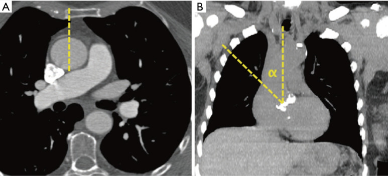
*図1｜**術前CT（軸位断）**：上行大動脈が胸骨傍線より右に**半周以上**露出していればRAT向き。大動脈−胸骨間距離も評価する｜出典: Lorenzo Di Bacco et al. *Journal of Thoracic Disease* 2021. doi:10.21037/jtd-20-1968 [PMC8024826](https://pmc.ncbi.nlm.nih.gov/articles/PMC8024826/)（CC BY-NC-ND）／原図: "Chest CT-scan preoperative evaluation. (A) In the axial view of thorax CT-scans the ideal exposure of the ascending aort…"*

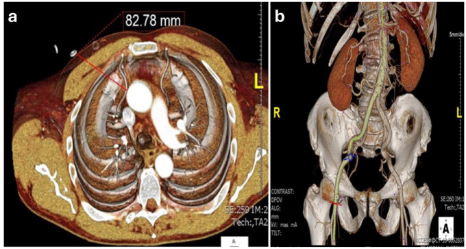
*図2｜**RAMTに好適なCT所見**：上行大動脈が左方偏位していない／第2–3肋間の高さで胸骨右縁から大動脈までが近い｜出典: Ali Fatehi Hassanabad et al. *Innovations (Philadelphia, Pa.)* 2024. doi:10.1177/15569845241276876 [PMC11619196](https://pmc.ncbi.nlm.nih.gov/articles/PMC11619196/)（CC BY-NC）／原図: "Preoperative CT scans showing anatomical features favorable for RAMT AVR. (a) Preoperative CT scan is essential for RAMT…"*

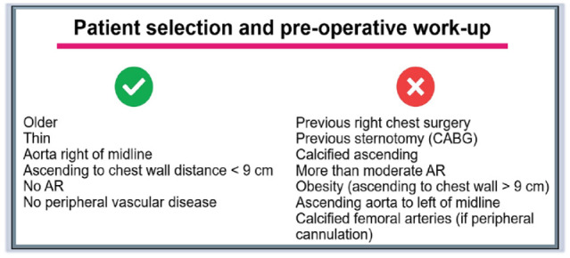
*図3｜**患者・解剖因子のチェックリスト**（欠けても禁忌ではないが難度が上がる因子）｜出典: Ali Fatehi Hassanabad et al. *Innovations (Philadelphia, Pa.)* 2024. doi:10.1177/15569845241276876 [PMC11619196](https://pmc.ncbi.nlm.nih.gov/articles/PMC11619196/)（CC BY-NC）／原図: "Suggested patient and anatomical factors for selecting patients for RAMT AVR. Lack of these criteria is not a contraindi…"*

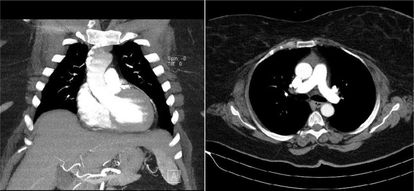
*図4｜**術前CT**：主肺動脈レベルで上行大動脈が**右方**に位置する症例が適応｜出典: Burcin Abud et al. *Brazilian Journal of Cardiovascular Surgery* 2022. doi:10.21470/1678-9741-2021-0098 [PMC9713646](https://pmc.ncbi.nlm.nih.gov/articles/PMC9713646/)（CC BY）／原図: "Preoperative computed tomography scan. Patients are suitable for this procedure if, at the level of the main pulmonary a…"*

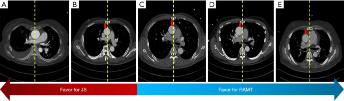
*図5｜**上行大動脈の位置によるアプローチ選択**：RAMT vs J字部分胸骨切開の振り分け｜出典: Mi Hee Lim et al. *Journal of Thoracic Disease* 2024. doi:10.21037/jtd-24-928 [PMC11565346](https://pmc.ncbi.nlm.nih.gov/articles/PMC11565346/)（CC BY-NC-ND）／原図: "Surgical approach determination based on ascending aorta position. Surgical approach based on the position of the ascend…"*

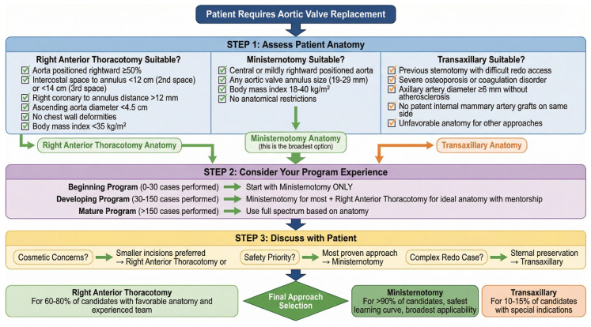
*図6｜**MIAVRアプローチ選択の3本柱モデル**（解剖・患者因子・術者/施設因子）｜出典: Adam R Kowalówka et al. *Life* 2026. doi:10.3390/life16050777 [PMC13208154](https://pmc.ncbi.nlm.nih.gov/articles/PMC13208154/)（CC BY）／原図: "Three-pillar decision model for MIAVR approach selection."*

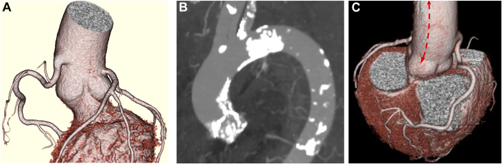
*図7｜**術前3D CT**：RCA高位起始・石灰化分布。横切開か縦切開かの判断材料｜出典: Masaya Nakamizo et al. *Annals of Thoracic Surgery Short Reports* 2025. doi:10.1016/j.atssr.2025.05.011 [PMC12712161](https://pmc.ncbi.nlm.nih.gov/articles/PMC12712161/)（CC BY）／原図: "(A) Preoperative 3-dimensional reconstructed contrast-enhanced computed tomographic image showing the high takeoff of th…"*

## 2. 体位

右前開胸・腋窩アプローチとも、右背部にロールを入れて**右胸を 20–30° 挙上**し、右上肢を頭側または下垂させて右前胸〜腋窩を展開する。
腋窩アプローチでは「**槍投げ（spear-throwing / javelin thrower's）体位**」と呼ばれる、右上肢を挙上して前腋窩線を露出する体位が用いられる。
体外式除細動パッドの貼付位置（右前胸を避け、左側胸部＋背部）と、鼠径部（大腿動静脈）を必ず消毒野に含めることを作図時に忘れないこと。

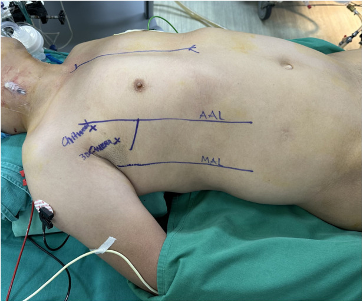
*図8｜**体位（完全内視鏡下AVR）**：右胸を挙上した仰臥位。右上肢の処理と体幹の傾斜角｜出典: Huu Cong Nguyen et al. *Frontiers in Cardiovascular Medicine* 2024. doi:10.3389/fcvm.2024.1468452 [PMC11496183](https://pmc.ncbi.nlm.nih.gov/articles/PMC11496183/)（CC BY）／原図: "Patient positioning."*

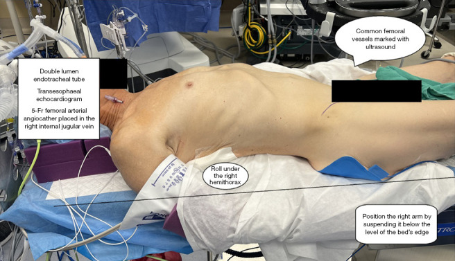
*図9｜**体位（側方アクセス・ロボットAVR）**：右側を約30°挙上、右腕を下垂｜出典: Ghulam Murtaza et al. *Annals of Cardiothoracic Surgery* 2025. doi:10.21037/acs-2025-ravr-0049 [PMC12177761](https://pmc.ncbi.nlm.nih.gov/articles/PMC12177761/)（CC BY-NC-ND）／原図: "Patient positioning."*

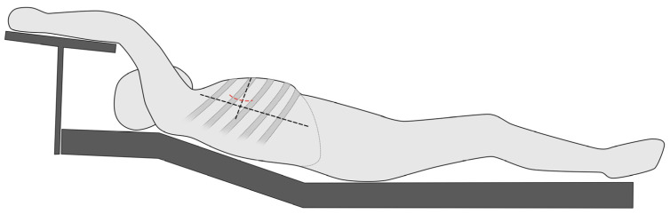
*図10｜**「槍投げ（spear-throwing）」体位**の模式図：右上肢を頭側へ挙上し右前胸〜腋窩を展開｜出典: Ali Taghizadeh-Waghefi et al. *Journal of Clinical Medicine* 2024. doi:10.3390/jcm13040985 [PMC10889463](https://pmc.ncbi.nlm.nih.gov/articles/PMC10889463/)（CC BY）／原図: "Schematic illustration regarding the positioning of the patient in the so-called spear-throwing position."*

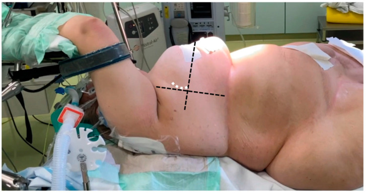
*図11｜**javelin thrower's position**（BMI 53.9の実例）：前腋窩線（水平破線）を基準に切開線を設定｜出典: Ali Taghizadeh-Waghefi et al. *Journal of Clinical Medicine* 2024. doi:10.3390/jcm13216529 [PMC11546103](https://pmc.ncbi.nlm.nih.gov/articles/PMC11546103/)（CC BY）／原図: "Javelin thrower’s position in a female patient with obesity (body mass index = 53.9 kg/m 2 ). The horizontal dashed line…"*

## 3. 皮切・ポート配置

オペレコの「創」の図で最も使われる部分。代表的な選択肢は以下の 4 つ。

| アプローチ | 主創の位置 | 備考 |
|---|---|---|
| **右前開胸（RAT / RAMT）** | 第 2 または第 3 肋間、胸骨右縁外側 5–6 cm | MICS AVR の主流。第 3 肋間は基部・上行まで届きやすい |
| **部分胸骨切開（J字）** | 胸骨柄〜第 3/4 肋間で右へ J 字に離断 | 上行大動脈が正中〜左方でも可。中枢送脱血が容易 |
| **部分胸骨切開（逆V字）** | 胸骨上部を逆V字に離断 | 胸骨体を温存 |
| **腋窩（transaxillary / MICLAT-S）** | 前腋窩線・第 3 肋間 | 創が腋窩に隠れ整容性に優れる |

完全内視鏡下（TE-AVR）では主創に加えて **working port・3D カメラポート・Chitwood クランプ刺入部**の 3 つを別に置く。
ポート数は施設により 2〜4 で、代表的な組み合わせは
「主創＝第 2〜3 肋間 / カメラ＝前腋窩線第 2〜3 肋間 / working port＝第 4 肋間 / Chitwood＝中腋窩線第 3 肋間」。

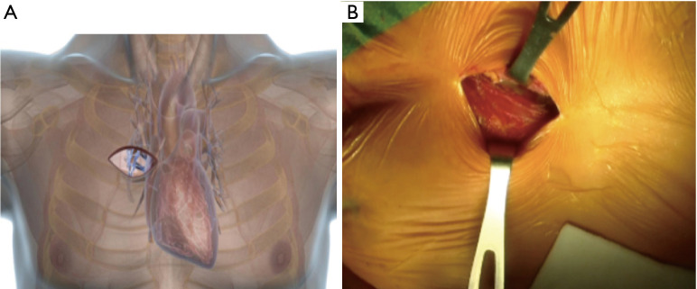
*図12｜**RAT：第2肋間**（A: 3Dレンダリング、B: 実際の皮切）— MICS AVRの標準的なmain創｜出典: Lorenzo Di Bacco et al. *Journal of Thoracic Disease* 2021. doi:10.21037/jtd-20-1968 [PMC8024826](https://pmc.ncbi.nlm.nih.gov/articles/PMC8024826/)（CC BY-NC-ND）／原図: "Right anterior minithoracotomy at second intercostal space. (A) RAT 3D animation rendering, (B) RAT surgical skin incisi…"*

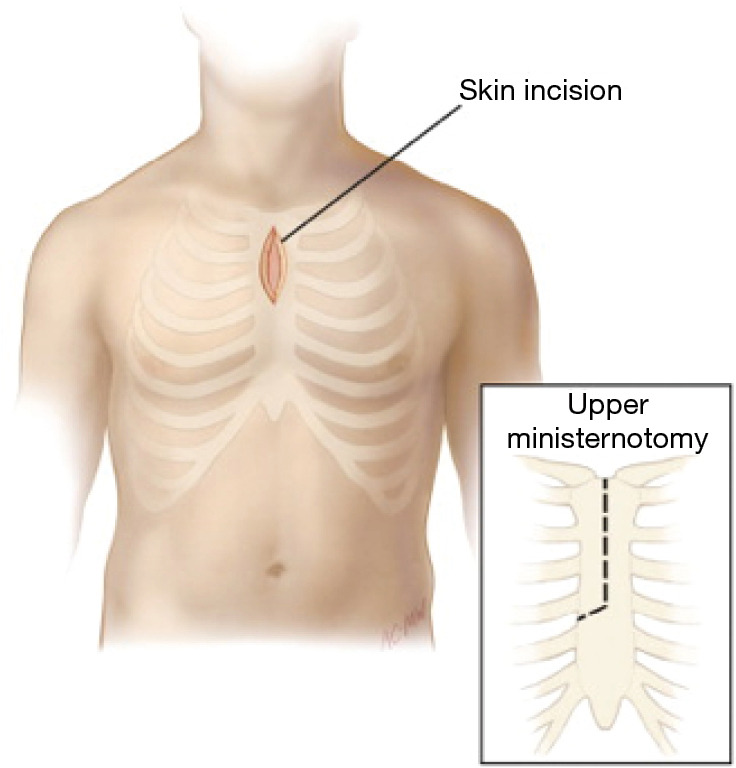
*図13｜**上位右J字部分胸骨切開**（J-ministernotomy）｜出典: Lorenzo Di Bacco et al. *Journal of Thoracic Disease* 2021. doi:10.21037/jtd-20-1968 [PMC8024826](https://pmc.ncbi.nlm.nih.gov/articles/PMC8024826/)（CC BY-NC-ND）／原図: "Upper right sided J-shaped ministernotomy."*

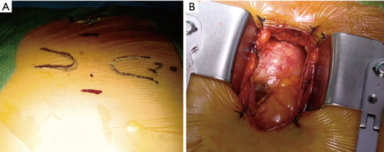
*図14｜**逆V字部分胸骨切開**（A: 皮膚マーキング、B: 術野）｜出典: Lorenzo Di Bacco et al. *Journal of Thoracic Disease* 2021. doi:10.21037/jtd-20-1968 [PMC8024826](https://pmc.ncbi.nlm.nih.gov/articles/PMC8024826/)（CC BY-NC-ND）／原図: "Exposure during aortic valve replacement in inverted V ministernotomy. (A) Skin drawing, (B) surgical exposure."*

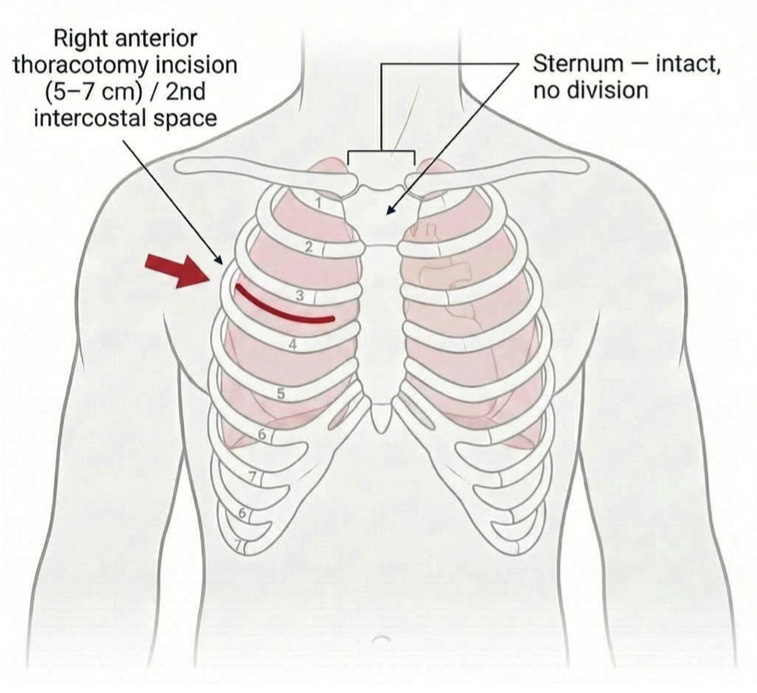
*図15｜**Right anterior thoracotomy**：創の位置と展開の模式図｜出典: Adam R Kowalówka et al. *Life* 2026. doi:10.3390/life16050777 [PMC13208154](https://pmc.ncbi.nlm.nih.gov/articles/PMC13208154/)（CC BY）／原図: "Right anterior thoracotomy."*

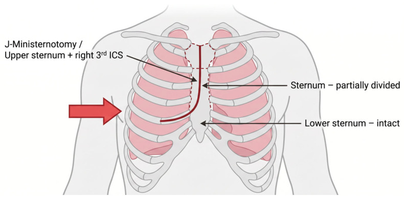
*図16｜**Ministernotomy（右J字切開）**：創の位置と展開の模式図｜出典: Adam R Kowalówka et al. *Life* 2026. doi:10.3390/life16050777 [PMC13208154](https://pmc.ncbi.nlm.nih.gov/articles/PMC13208154/)（CC BY）／原図: "Ministernotomy—J-Incision (right)."*

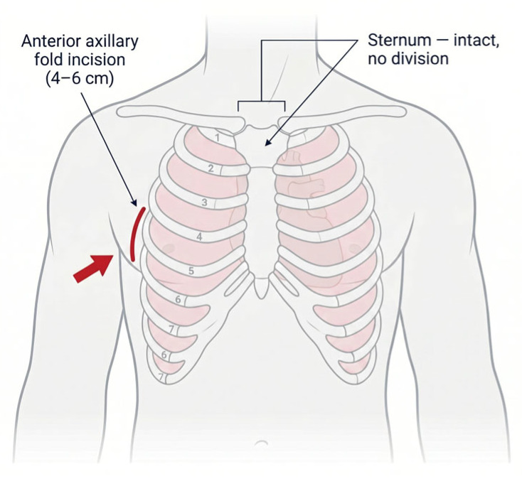
*図17｜**Transaxillary access**：腋窩アプローチの創の位置｜出典: Adam R Kowalówka et al. *Life* 2026. doi:10.3390/life16050777 [PMC13208154](https://pmc.ncbi.nlm.nih.gov/articles/PMC13208154/)（CC BY）／原図: "Transaxillary access."*

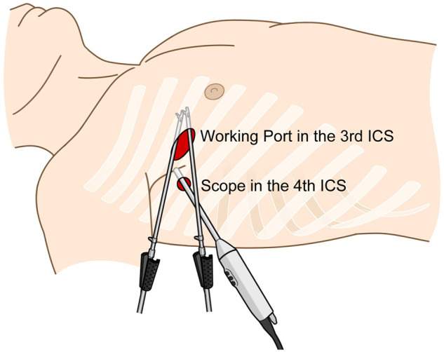
*図18｜**2ポート法の模式図**：main創＝第3肋間・鎖骨中線／ポート＝第4肋間・前腋窩線｜出典: Sahri Kim et al. *Interdisciplinary Cardiovascular and Thoracic Surgery* 2025. doi:10.1093/icvts/ivaf030 [PMC11997802](https://pmc.ncbi.nlm.nih.gov/articles/PMC11997802/)（CC BY）／原図: "Schematic image showing the main thoracotomy (third intercostal space, midclavicular line) and port insertion site (four…"*

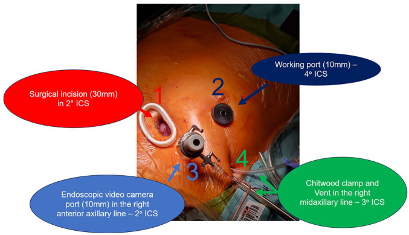
*図19｜**完全内視鏡下AVRの4ポート**：(1)術野切開 (2)working port (3)内視鏡カメラ (4)Chitwoodクランプ｜出典: Gianpiero Buttiglione et al. *Innovations (Philadelphia, Pa.)* 2025. doi:10.1177/15569845251344614 [PMC12398630](https://pmc.ncbi.nlm.nih.gov/articles/PMC12398630/)（CC BY-NC）／原図: "The image shows the 4 ports used for totally endoscopic aortic valve replacement: (1) surgical incision, (2) working por…"*

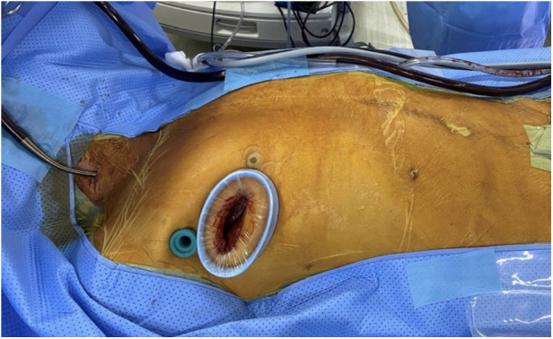
*図20｜**single working port＋3D内視鏡**の配置｜出典: Huu Cong Nguyen et al. *Frontiers in Cardiovascular Medicine* 2024. doi:10.3389/fcvm.2024.1468452 [PMC11496183](https://pmc.ncbi.nlm.nih.gov/articles/PMC11496183/)（CC BY）／原図: "Placement of single working port and 3D endoscopic camera."*

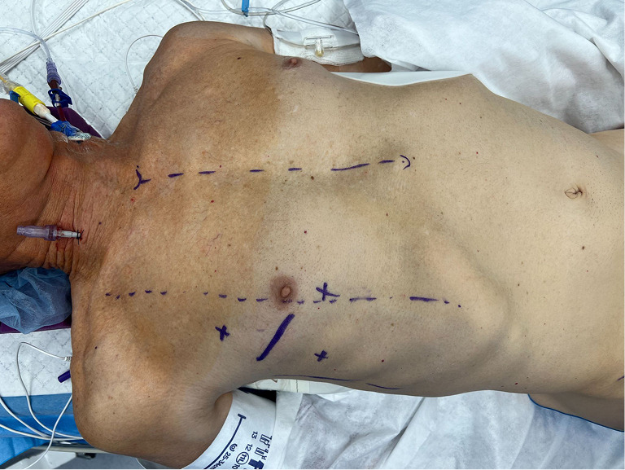
*図21｜**ランドマークと切開計画**：第4肋間をアクセス創とし、ロボットポートは1肋間上下に配置｜出典: Ghulam Murtaza et al. *Annals of Cardiothoracic Surgery* 2025. doi:10.21037/acs-2025-ravr-0049 [PMC12177761](https://pmc.ncbi.nlm.nih.gov/articles/PMC12177761/)（CC BY-NC-ND）／原図: "Landmarks and incision planning. 4th intercostal space is marked as the access incision. Robot port sites are placed one…"*

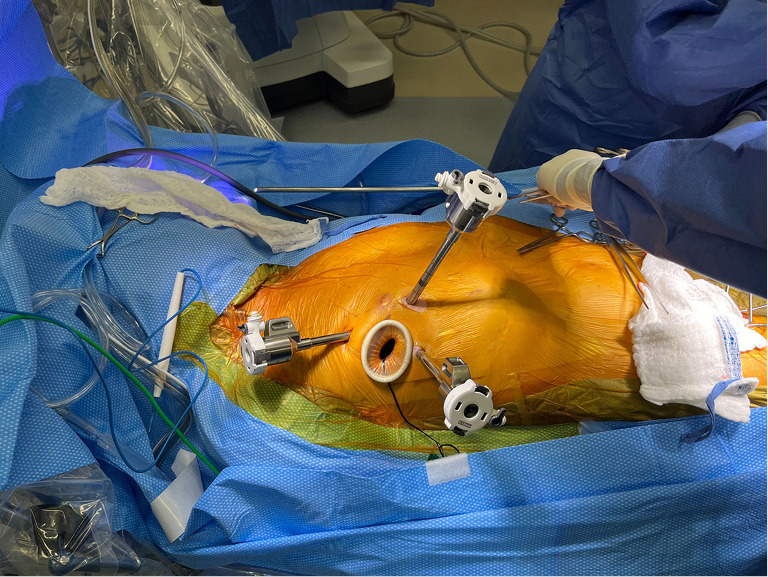
*図22｜**ロボットポートとアクセス創の位置関係**｜出典: Ghulam Murtaza et al. *Annals of Cardiothoracic Surgery* 2025. doi:10.21037/acs-2025-ravr-0049 [PMC12177761](https://pmc.ncbi.nlm.nih.gov/articles/PMC12177761/)（CC BY-NC-ND）／原図: "Robotic port placement in relation to access port."*

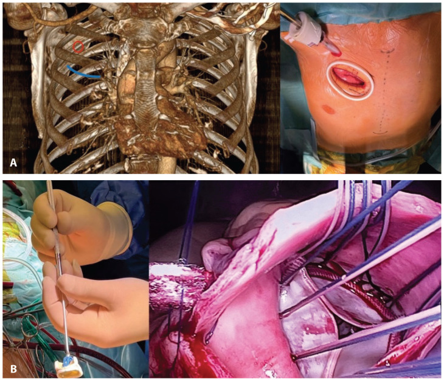
*図23｜**術前の切開計画**：赤＝カメラポート、青＝切開線／B＝柔軟支持体の生体弁｜出典: Paweł Czub et al. *Cardiology Journal* 2026. doi:10.5603/cj.106564 [PMC13262695](https://pmc.ncbi.nlm.nih.gov/articles/PMC13262695/)（CC BY-NC-ND）／原図: "A . Surgical access – 3D endoscopic camera and thoracotomy; surgical planning (red — camera port; blue — incision line);…"*

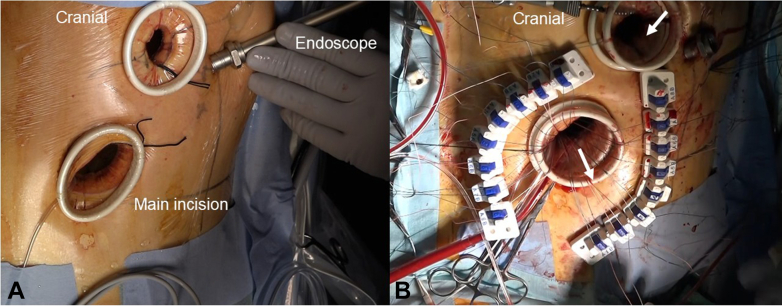
*図24｜**2-window ポート配置**と弁固定糸の運針経路（白矢印）｜出典: Akitoshi Yamada et al. *JTCVS Techniques* 2025. doi:10.1016/j.xjtc.2025.09.019 [PMC12683039](https://pmc.ncbi.nlm.nih.gov/articles/PMC12683039/)（CC BY）／原図: "A, Surgical ports were arranged to allow a 2-window access from the left side. B, The suture pathway for valve fixation …"*

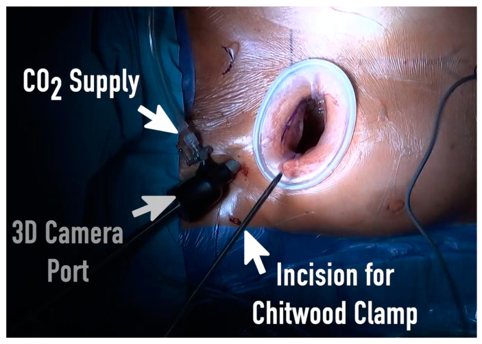
*図25｜**RAMT第3肋間の術野**：soft tissue retractor、3Dカメラポート、Chitwoodクランプ刺入部｜出典: Marwan Hamiko et al. *Journal of Clinical Medicine* 2024. doi:10.3390/jcm13092648 [PMC11084888](https://pmc.ncbi.nlm.nih.gov/articles/PMC11084888/)（CC BY）／原図: "View of the surgical field with right anterior mini-thoracotomy (RAMT) via the third intercostal space with the soft tis…"*

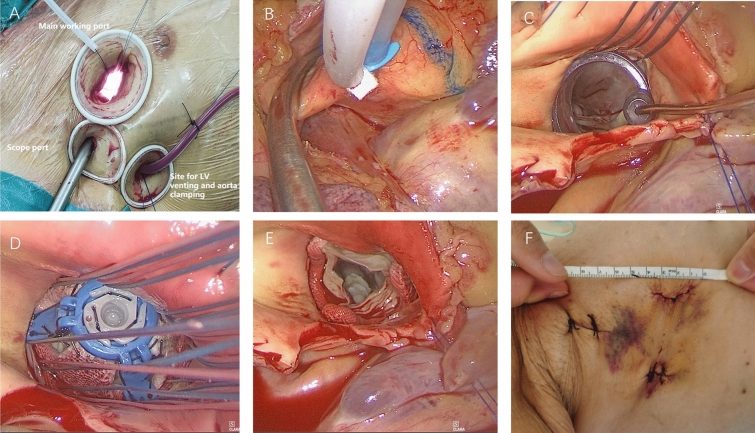
*図26｜**完全胸腔鏡下AVR**：(A)創の配置 (B)クランプ後の大動脈基部ベントからの順行性心筋保護｜出典: Hua Shen et al. *Scientific Reports* 2024. doi:10.1038/s41598-024-67018-5 [PMC11291665](https://pmc.ncbi.nlm.nih.gov/articles/PMC11291665/)（CC BY-NC-ND）／原図: "Operative setup of totally thoracoscope AVR. ( A) Incisions of totally thoracoscope AVR; ( B) After safe cross-clamping,…"*

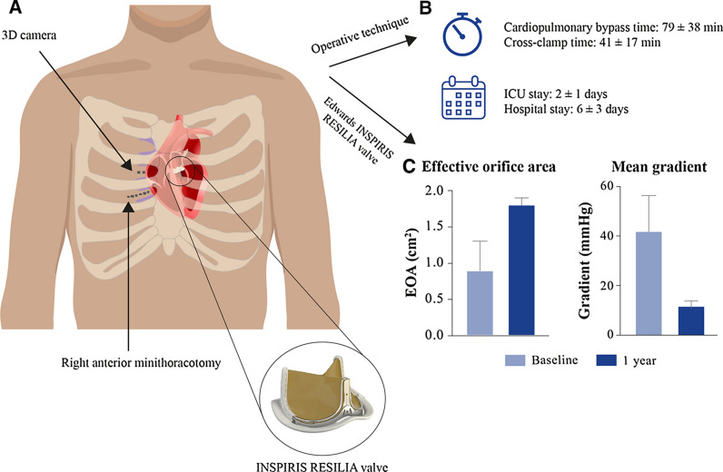
*図27｜**RAMTアクセスと3Dカメラ**（video-assisted MICS AVR 100例）｜出典: Ali El-Sayed Ahmad et al. *Advances in Therapy* 2021. doi:10.1007/s12325-021-01705-x [PMC8010499](https://pmc.ncbi.nlm.nih.gov/articles/PMC8010499/)（CC BY-NC）／原図: "Outcomes following implantation of INSPIRIS RESILIA aortic valve via video-assisted right anterior mini-thoracotomy. a A…"*

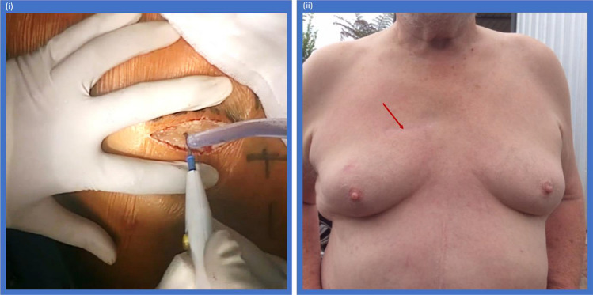
*図28｜**5cm皮切**の術中所見と術後の整容性｜出典: Rong Hui (Misté) Chia et al. *Indian Journal of Thoracic and Cardiovascular Surgery* 2023. doi:10.1007/s12055-023-01596-3 [PMC10879061](https://pmc.ncbi.nlm.nih.gov/articles/PMC10879061/)（CC BY）／原図: "(i) A 5-cm incision for RAT AVR intraoperatively. (ii) Incision wound postoperatively, demonstrating outstanding cosmesi…"*

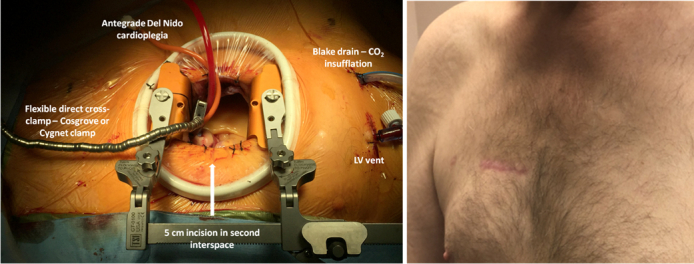
*図29｜**RAMT AVRの術野セットアップ（左）と術後創（右）**（国際多施設研究）｜出典: Ali Fatehi Hassanabad et al. *JTCVS Open* 2025. doi:10.1016/j.xjon.2025.101553 [PMC13059857](https://pmc.ncbi.nlm.nih.gov/articles/PMC13059857/)（CC BY-NC-ND）／原図: "The surgical setup for RAMT AVR (left) and the postoperative incision (right)."*

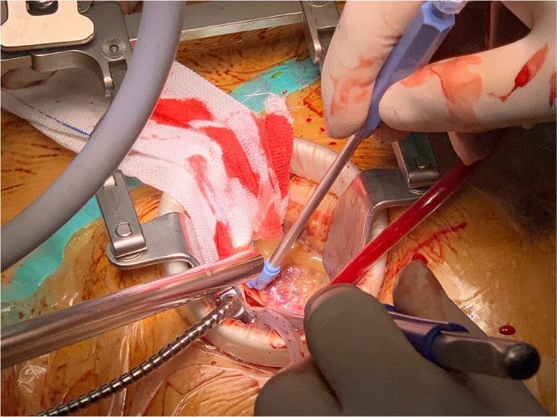
*図30｜**MIAVRの術野セットアップ**（右前胸壁）｜出典: Anas O Kh Abubokha et al. *Brazilian Journal of Cardiovascular Surgery* 2024. doi:10.21470/1678-9741-2023-0108 [PMC10989319](https://pmc.ncbi.nlm.nih.gov/articles/PMC10989319/)（CC BY）／原図: "Minimally invasive aortic valve replacement surgical setup."*

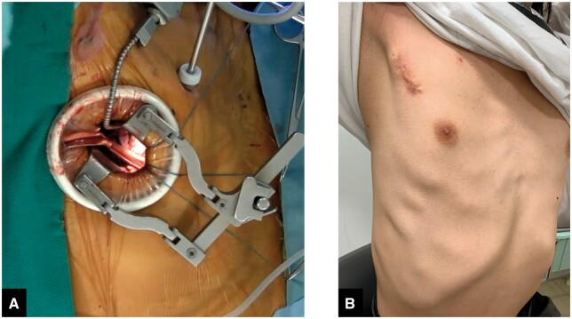
*図31｜**右側方mini-thoracotomy**：(A)術野 (B)同一症例の術後皮切｜出典: Yoshitsugu Nakamura et al. *Interdisciplinary Cardiovascular and Thoracic Surgery* 2024. doi:10.1093/icvts/ivae224 [PMC11729723](https://pmc.ncbi.nlm.nih.gov/articles/PMC11729723/)（CC BY）／原図: "(A) Intraoperative view of the surgical field in aortic valve replacement through right lateral mini-thoracotomy. (B) Po…"*

## 4. 送脱血・心筋保護（AR で最重要）

**AR 症例の MICS AVR で最大の技術的問題は心筋保護である。** 大動脈基部からの順行性心筋保護は逆流によって左室へ流れ込むため機能しない。
選択肢は 3 つで、いずれも作図が必要になる。

1. **大動脈切開後の冠動脈口への直接注入（selective ostial cardioplegia）** — 最も広く使われる。
   東京ベイ浦安市川医療センター/順天堂の 104 例（moderate 以上の AI）の報告では、遮断前に **KCl とランジオロールを全身投与**して細動・停止させたうえで大動脈を切開し、内視鏡ガイド下に左右冠動脈口へ選択的に冷晶質液を注入。
   完全胸骨切開への転換 0 例、手術死亡 0 例、平均遮断時間 72.5 ± 21.8 分（Ito J, et al. *JTCVS Tech* 2023;18:28-36. doi:10.1016/j.xjtc.2023.01.002）。
2. **逆行性（冠静脈洞）心筋保護** — 右房を開いて冠静脈洞にカニューレを purse-string で留置し、持続冷血逆行性心筋保護（700 mL/h）を行う方法（Sato S, et al. *Ann Thorac Cardiovasc Surg* 2022;28:36-40. doi:10.5761/atcs.nm.20-00293）。均一な心筋冷却が得られる。
3. **経皮的冠静脈洞カニューレ** — 内頸静脈から留置。MICS 用だが施設限定。

送脱血は、上行大動脈への**中枢送血**（右前開胸でも purse-string を直視下にかけられる）と**大腿動脈送血**の二択。
中枢送血は逆行性灌流による脳塞栓リスクを避けられるため、可能なら第一選択とする施設が多い。
遮断は **Chitwood-DeBakey 型の経胸壁クランプ**を別刺入孔から入れるのが標準。

AR ではさらに、遮断までの間に逆流で左室が膨満するため **左室ベント（右上肺静脈経由）を早期に確保**することが重要。

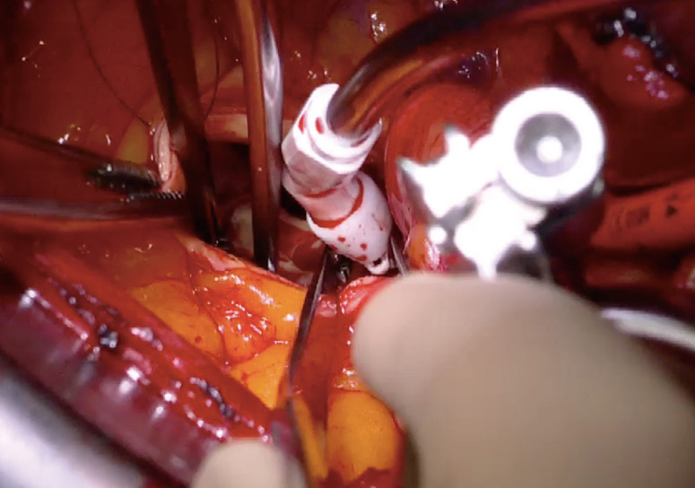
*図32｜**冠動脈口への直接心筋保護液注入**（ministernotomy）— ==ARでは順行性大動脈基部投与が無効になるため、大動脈切開後にostial cannulaで直接注入する==｜出典: Lorenzo Di Bacco et al. *Journal of Thoracic Disease* 2021. doi:10.21037/jtd-20-1968 [PMC8024826](https://pmc.ncbi.nlm.nih.gov/articles/PMC8024826/)（CC BY-NC-ND）／原図: "Cardioplegia delivery through the coronary ostia in ministernotomy."*

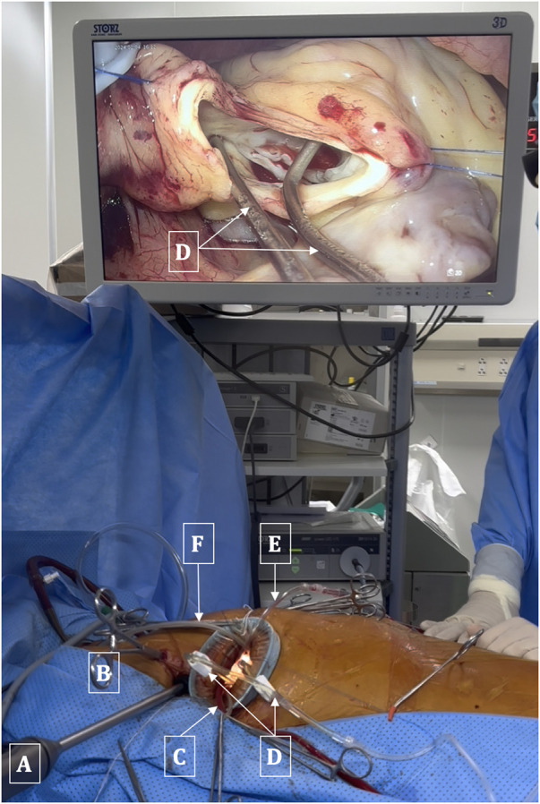
*図33｜**器具配置**：(A)3D内視鏡 (B)Chitwoodクランプ (C)左ベント (D)==冠動脈口投与用ダブルカニューレ==｜出典: Huu Cong Nguyen et al. *Frontiers in Cardiovascular Medicine* 2024. doi:10.3389/fcvm.2024.1468452 [PMC11496183](https://pmc.ncbi.nlm.nih.gov/articles/PMC11496183/)（CC BY）／原図: "Arrangement of surgical instruments. (A) 3D Endoscopic camera. (B) Chitwood clamp. (C) Left venting line. (D) Dual cannu…"*

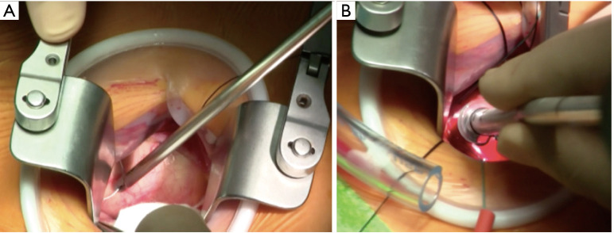
*図34｜**上行大動脈直接送血**：(A)purse-string (B)カニュレーション（RAT）｜出典: Lorenzo Di Bacco et al. *Journal of Thoracic Disease* 2021. doi:10.21037/jtd-20-1968 [PMC8024826](https://pmc.ncbi.nlm.nih.gov/articles/PMC8024826/)（CC BY-NC-ND）／原図: "Direct aortic cannulation in right anterior minithoracotomy. (A) Purse-strings on ascending aorta for direct aorta cannu…"*

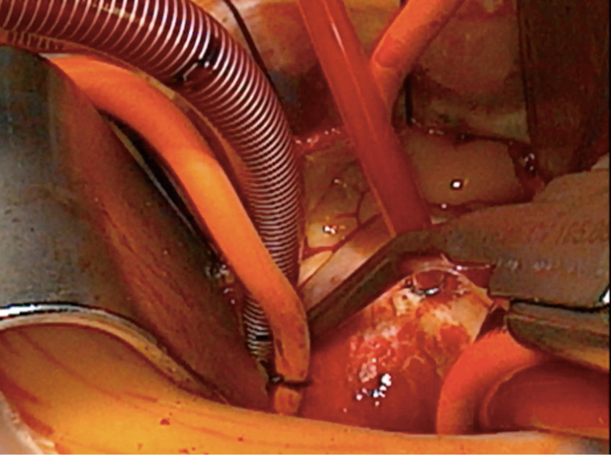
*図35｜**着脱式（transthoracic）大動脈クランプ**｜出典: Lorenzo Di Bacco et al. *Journal of Thoracic Disease* 2021. doi:10.21037/jtd-20-1968 [PMC8024826](https://pmc.ncbi.nlm.nih.gov/articles/PMC8024826/)（CC BY-NC-ND）／原図: "Aortic cross-clamp in RAT with detachable clamp. RAT, right anterior thoracotomy."*

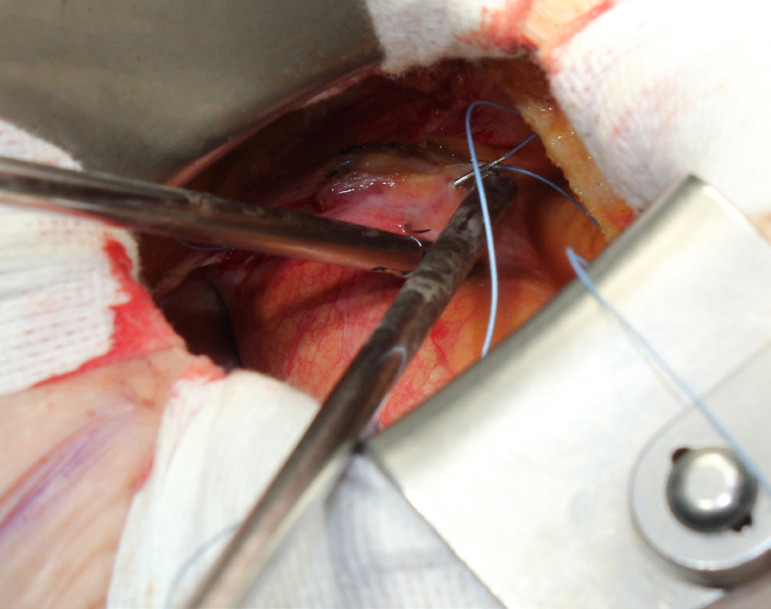
*図36｜**心膜翻転部レベルの大動脈purse-string**｜出典: Gabriele Tamagnini et al. *Brazilian Journal of Cardiovascular Surgery* 2021. doi:10.21470/1678-9741-2020-0165 [PMC7918393](https://pmc.ncbi.nlm.nih.gov/articles/PMC7918393/)（CC BY）／原図: "Aortic purse-string sutures at the level of the pericardial reflection."*

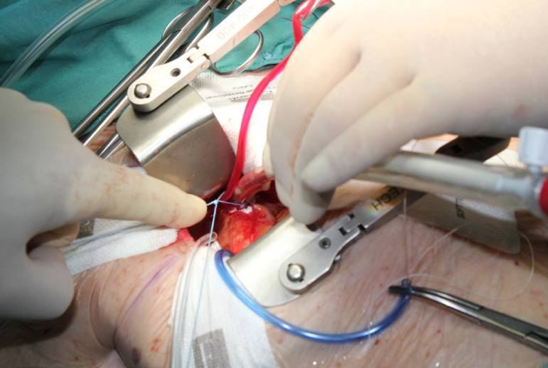
*図37｜**大動脈カニュレーション**（術者視野）｜出典: Gabriele Tamagnini et al. *Brazilian Journal of Cardiovascular Surgery* 2021. doi:10.21470/1678-9741-2020-0165 [PMC7918393](https://pmc.ncbi.nlm.nih.gov/articles/PMC7918393/)（CC BY）／原図: "Aortic cannulation: handier than it may seem."*

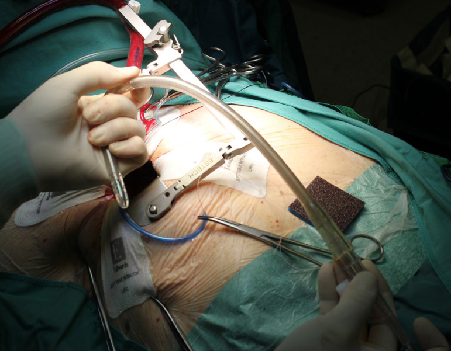
*図38｜**静脈カニューレを金属spindleで屈曲**させてIVCへ誘導｜出典: Gabriele Tamagnini et al. *Brazilian Journal of Cardiovascular Surgery* 2021. doi:10.21470/1678-9741-2020-0165 [PMC7918393](https://pmc.ncbi.nlm.nih.gov/articles/PMC7918393/)（CC BY）／原図: "Bending the venous cannula with a metal spindle makes it easier to engage the inferior vena cava."*

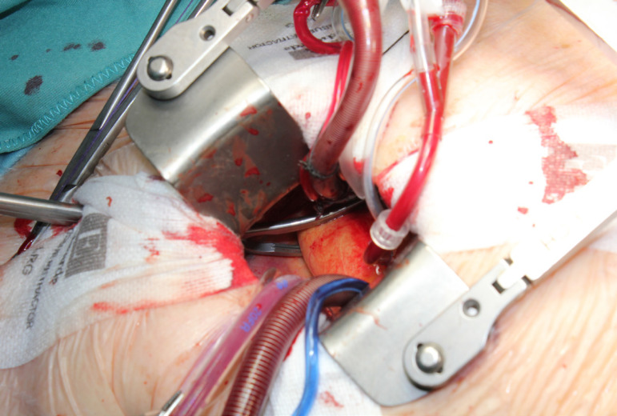
*図39｜**Chitwood-DeBakeyクランプ**による大動脈遮断｜出典: Gabriele Tamagnini et al. *Brazilian Journal of Cardiovascular Surgery* 2021. doi:10.21470/1678-9741-2020-0165 [PMC7918393](https://pmc.ncbi.nlm.nih.gov/articles/PMC7918393/)（CC BY）／原図: "Aortic cross-clamping with a Chitwood- DeBakey clamp."*

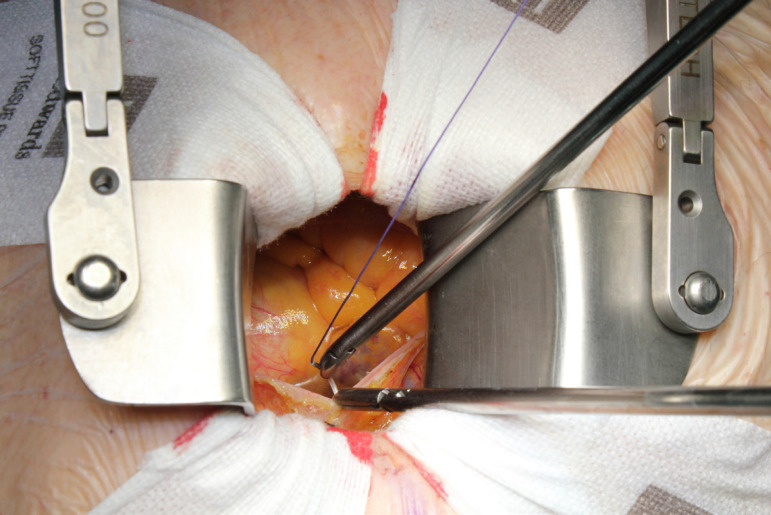
*図40｜**心膜切開**（術者視野）｜出典: Gabriele Tamagnini et al. *Brazilian Journal of Cardiovascular Surgery* 2021. doi:10.21470/1678-9741-2020-0165 [PMC7918393](https://pmc.ncbi.nlm.nih.gov/articles/PMC7918393/)（CC BY）／原図: "Surgeon's view: opening the pericardium."*

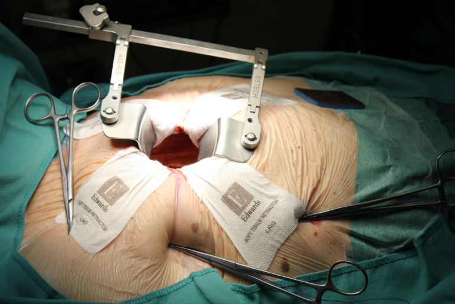
*図41｜**胸壁外へ通した3本の心膜吊り上げ糸**｜出典: Gabriele Tamagnini et al. *Brazilian Journal of Cardiovascular Surgery* 2021. doi:10.21470/1678-9741-2020-0165 [PMC7918393](https://pmc.ncbi.nlm.nih.gov/articles/PMC7918393/)（CC BY）／原図: "The three pericardial retraction stitches through the thoracic wall."*

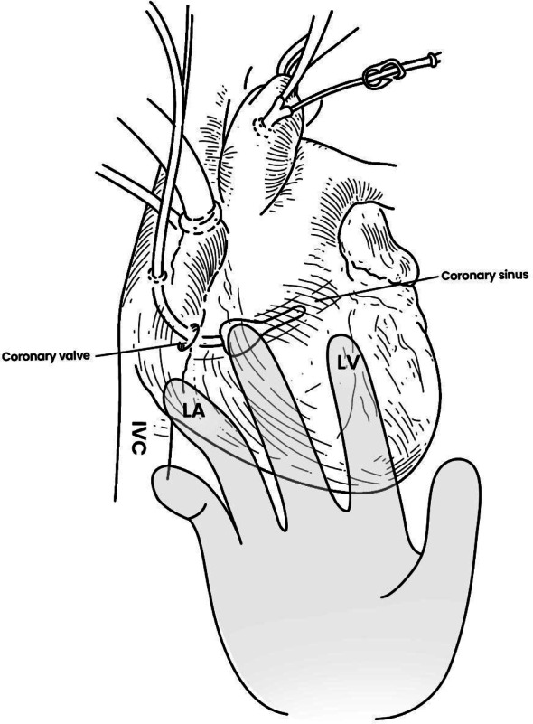
*図42｜**逆行性心筋保護カニューレ挿入の4-finger法**：右手を横隔膜面から後面へ進める｜出典: Walid Hammad et al. *Journal of Cardiothoracic Surgery* 2026. doi:10.1186/s13019-026-04230-6 [PMC13200289](https://pmc.ncbi.nlm.nih.gov/articles/PMC13200289/)（CC BY-NC-ND）／原図: "The surgeon’s right hand is positioned on the diaphragmatic surface of the heart and advanced toward the posterior surfa…"*

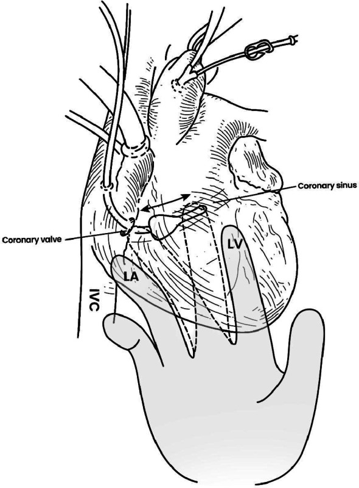
*図43｜**4-finger法の正しい指位置**：中指が左房室溝を滑り、薬指と心房壁接合部で接する｜出典: Walid Hammad et al. *Journal of Cardiothoracic Surgery* 2026. doi:10.1186/s13019-026-04230-6 [PMC13200289](https://pmc.ncbi.nlm.nih.gov/articles/PMC13200289/)（CC BY-NC-ND）／原図: "In the correct positioning of the 4-finger technique, the middle finger slides along the left atrioventricular (AV) groo…"*

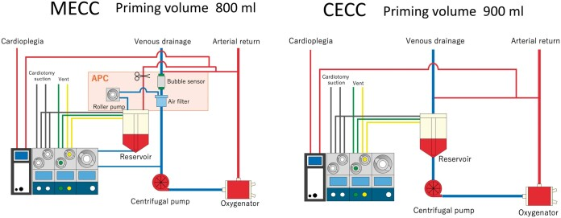
*図44｜**MECC（低充填量体外循環）とCECCの回路比較**｜出典: Yoshitsugu Nakamura et al. *Interdisciplinary Cardiovascular and Thoracic Surgery* 2024. doi:10.1093/icvts/ivae224 [PMC11729723](https://pmc.ncbi.nlm.nih.gov/articles/PMC11729723/)（CC BY）／原図: "Schematic of minimally invasive extracorporeal circulation and conventional extracorporeal circulation. MECC: minimally …"*

## 5. 大動脈切開・弁露出・弁縫着

**大動脈切開**は、従来の**横切開（hockey-stick）**と、内視鏡下で普及した**縦切開（longitudinal / TATEGIRI）**がある。
縦切開は無冠尖に向けて縦に延長するもので、270° の弁輪露出が得られ、RCA 高位起始例でも安全域が広い。閉鎖は 2 層縫合。

AR では弁尖に石灰化がないため**弁切除自体は容易**で、AS のようなデブリードマンや弁輪石灰化の処理はほぼ不要。
一方で**弁輪が軟らかく拡大している**ため、
- サイジングは慎重に（過大サイズは弁輪破裂・冠動脈口閉塞のリスク）
- 縫合は everting mattress（pledget を左室側）か non-everting mattress か連続縫合か、施設方針を明示

を作図で示すとよい。自動結紮（Cor-Knot）を使う場合は、**ファスナーの向きを Valsalva 洞と反対側に向ける**こと。逆向きで洞穿孔をきたした報告がある（図 av13/av14）。

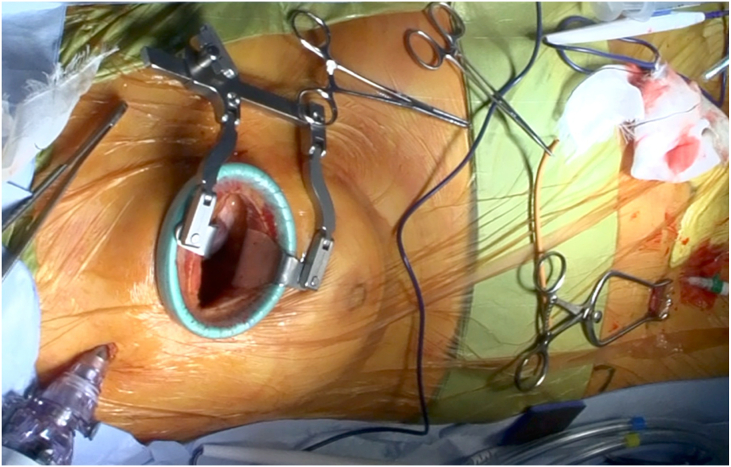
*図45｜**術野セッティング**（RAMT・縦切開症例）｜出典: Masaya Nakamizo et al. *Annals of Thoracic Surgery Short Reports* 2025. doi:10.1016/j.atssr.2025.05.011 [PMC12712161](https://pmc.ncbi.nlm.nih.gov/articles/PMC12712161/)（CC BY）／原図: "Surgical field setting in patient 2."*

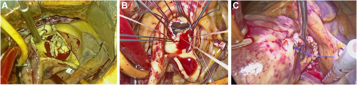
*図46｜**(A)切開部からの大動脈弁視野 (B)弁輪へのnon-everting mattress縫合 (C)閉鎖した切開線**｜出典: Masaya Nakamizo et al. *Annals of Thoracic Surgery Short Reports* 2025. doi:10.1016/j.atssr.2025.05.011 [PMC12712161](https://pmc.ncbi.nlm.nih.gov/articles/PMC12712161/)（CC BY）／原図: "(A) Surgical vision of the aortic valve from the incision site in patient 5. (B) Noneverting mattress suture on the aort…"*

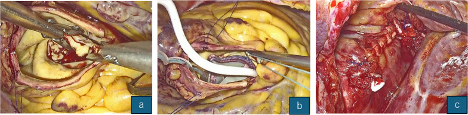
*図47｜**TATEGIRI（縦）切開**：(a)穿刺部から無冠尖へ縦方向に延長 (b)弁尖切除後の270°弁輪露出｜出典: Hitoki Hashiguchi et al. *Journal of Cardiothoracic Surgery* 2025. doi:10.1186/s13019-025-03613-5 [PMC12535169](https://pmc.ncbi.nlm.nih.gov/articles/PMC12535169/)（CC BY）／原図: "Total endoscopic view of the TATEGIRI incision. ( a ) Initial puncture site and longitudinal extension toward the non-co…"*

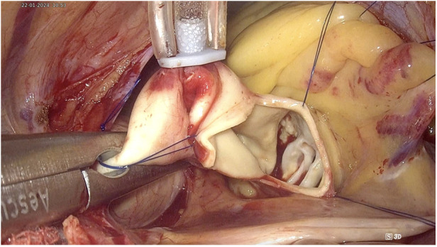
*図48｜**吊り上げ糸による大動脈弁の露出**｜出典: Huu Cong Nguyen et al. *Frontiers in Cardiovascular Medicine* 2024. doi:10.3389/fcvm.2024.1468452 [PMC11496183](https://pmc.ncbi.nlm.nih.gov/articles/PMC11496183/)（CC BY）／原図: "Exposure of aortic valve with retraction sutures."*

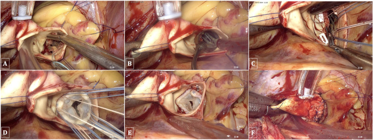
*図49｜**弁置換の一連**：(A)弁切除・デブリードマン (B)サイジング (C)弁輪縫合 (D)生体弁移植｜出典: Huu Cong Nguyen et al. *Frontiers in Cardiovascular Medicine* 2024. doi:10.3389/fcvm.2024.1468452 [PMC11496183](https://pmc.ncbi.nlm.nih.gov/articles/PMC11496183/)（CC BY）／原図: "TEAVR. (A) Resection of the aortic valve and debridement of calcifications. (B) Evaluating the valve size. (C) Suturing …"*

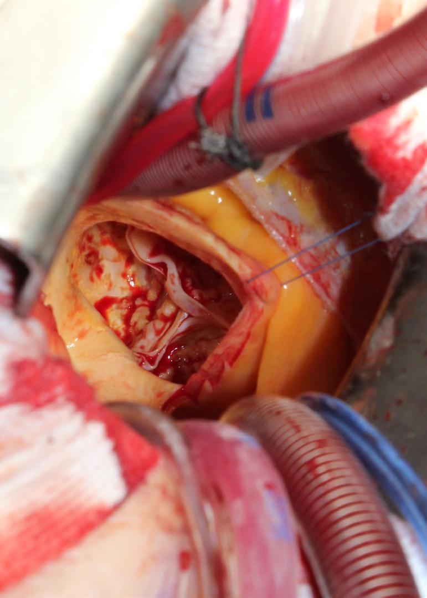
*図50｜**直視下に見た病的大動脈弁**（RAMT）｜出典: Gabriele Tamagnini et al. *Brazilian Journal of Cardiovascular Surgery* 2021. doi:10.21470/1678-9741-2020-0165 [PMC7918393](https://pmc.ncbi.nlm.nih.gov/articles/PMC7918393/)（CC BY）／原図: "Diseased aortic valve from the surgeon's spot: we performed this operation in direct view"*

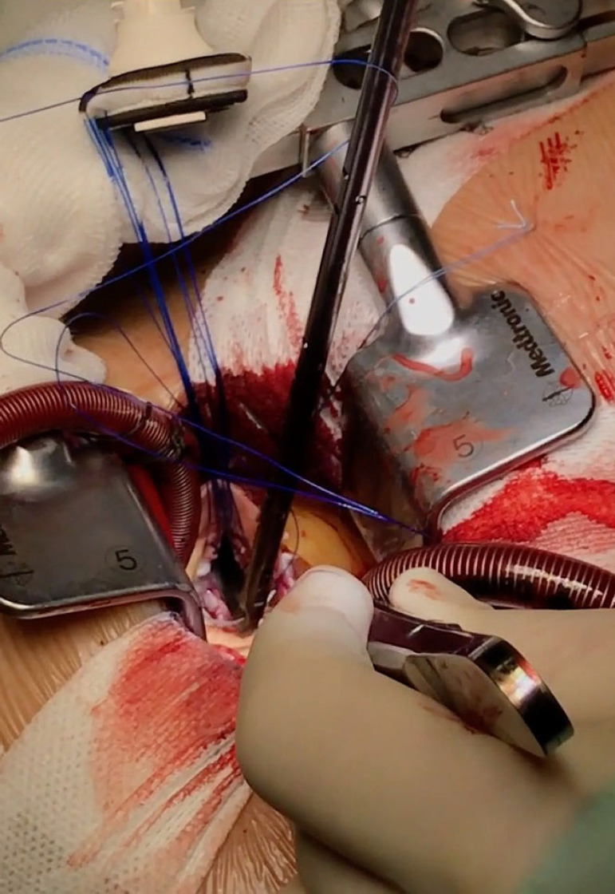
*図51｜**3本の連続縫合**による人工弁縫着（縫合弁の場合）｜出典: Gabriele Tamagnini et al. *Brazilian Journal of Cardiovascular Surgery* 2021. doi:10.21470/1678-9741-2020-0165 [PMC7918393](https://pmc.ncbi.nlm.nih.gov/articles/PMC7918393/)（CC BY）／原図: "In sutured prostheses, we prefer to implant the valve with 3 running sutures."*

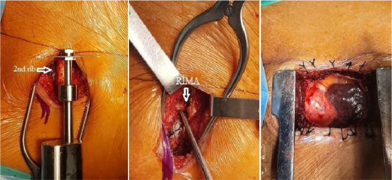
*図52｜**心臓・大血管の露出**（RAMT・中枢送脱血）｜出典: Burcin Abud et al. *Brazilian Journal of Cardiovascular Surgery* 2022. doi:10.21470/1678-9741-2021-0098 [PMC9713646](https://pmc.ncbi.nlm.nih.gov/articles/PMC9713646/)（CC BY）／原図: "Exposure of the heart and its vessels."*

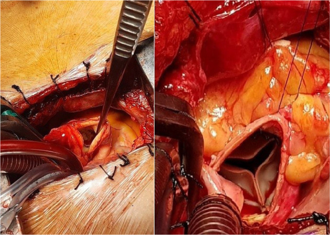
*図53｜**大動脈切開と人工弁移植**｜出典: Burcin Abud et al. *Brazilian Journal of Cardiovascular Surgery* 2022. doi:10.21470/1678-9741-2021-0098 [PMC9713646](https://pmc.ncbi.nlm.nih.gov/articles/PMC9713646/)（CC BY）／原図: "Aortotomy and implantation of the aortic prothesis."*

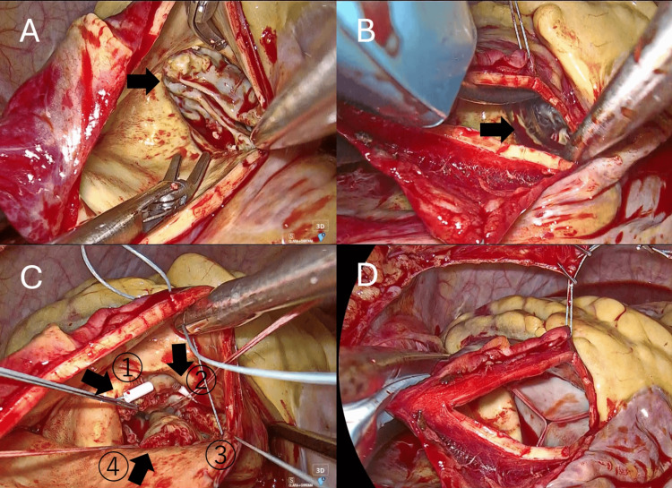
*図54｜**(A)縦切開での弁露出 (B)29mm INSPIRISサイザーによるサイジング (C)4本のeverting suture**｜出典: Hitoki Hashiguchi et al. *Cureus* 2025. doi:10.7759/cureus.93050 [PMC12569147](https://pmc.ncbi.nlm.nih.gov/articles/PMC12569147/)（CC BY）／原図: "(A) Exposure of the aortic valve using a longitudinal incision, revealing a type 0 bicuspid aortic valve. (B) Sizing of …"*

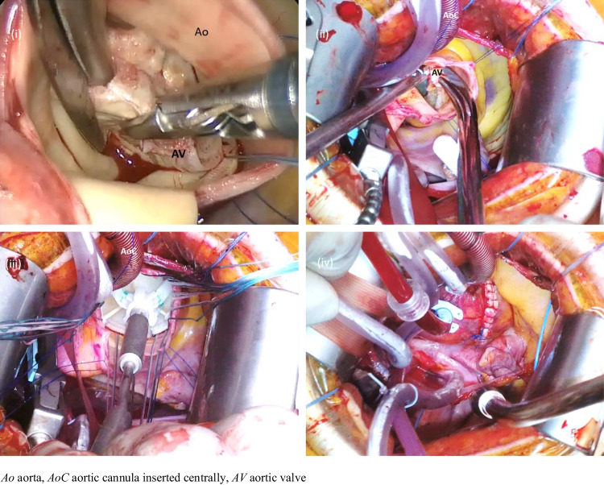
*図55｜**RAT創からの術野**：大動脈弁と周囲縦隔構造の展開｜出典: Rong Hui (Misté) Chia et al. *Indian Journal of Thoracic and Cardiovascular Surgery* 2023. doi:10.1007/s12055-023-01596-3 [PMC10879061](https://pmc.ncbi.nlm.nih.gov/articles/PMC10879061/)（CC BY）／原図: "Intraoperative views through a RAT incision. The focussed view via RAT incision still provided good exposure of pertinen…"*

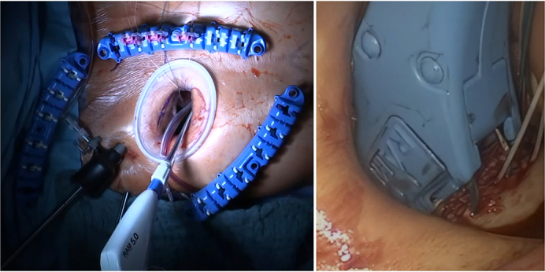
*図56｜**自動弁輪縫合デバイス（RAM）の展開**｜出典: Saad Salamate et al. *JTCVS Techniques* 2025. doi:10.1016/j.xjtc.2025.09.034 [PMC12683065](https://pmc.ncbi.nlm.nih.gov/articles/PMC12683065/)（CC BY）／原図: "The RAM device being deployed in a totally endoscopic aortic valve surgery."*

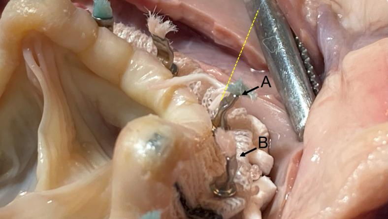
*図57｜**Cor-Knotの向き（pitfall）**：A=推奨（ファスナー辺をValsalva洞側へ） B=逆向きで洞穿孔リスク｜出典: Akitoshi Yamada et al. *JTCVS Techniques* 2025. doi:10.1016/j.xjtc.2025.06.020 [PMC12529675](https://pmc.ncbi.nlm.nih.gov/articles/PMC12529675/)（CC BY）／原図: "Ex vivo porcine heart simulation demonstrating Cor-Knot deployment during Epic valve implantation. A, Recommended orient…"*

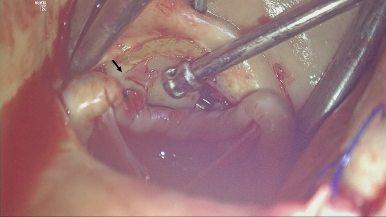
*図58｜**Valsalva洞穿孔**（Cor-Knotファスナーによる機械的損傷）｜出典: Akitoshi Yamada et al. *JTCVS Techniques* 2025. doi:10.1016/j.xjtc.2025.06.020 [PMC12529675](https://pmc.ncbi.nlm.nih.gov/articles/PMC12529675/)（CC BY）／原図: "Still image from Video 1 . A solitary perforation was observed on the Valsalva sinus, directly caused by mechanical inju…"*

## 6. 人工弁（Avalus ほか）

**Avalus™（Medtronic）** はウシ心膜弁で、支持フレームが **PEEK（ポリエーテルエーテルケトン）製＝金属フリー**、
硫酸バリウム含浸により X 線不透過性を確保している。弁尖は内側マウント（interior mounting）で、将来の valve-in-valve での冠動脈閉塞リスクを下げる設計。
縫合輪には**弁尖の中点／nadir にマーカー**があり、縫合間隔を等分しやすい。抗石灰化処理は AOA（alpha-amino oleic acid）。
金属アレルギー症例で選択される（PMC13245353）。

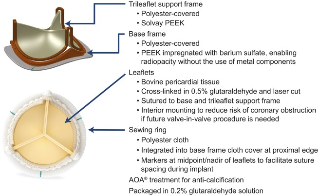
*図59｜**Avalus生体弁（Medtronic）の写真と模式図** — ウシ心膜弁。PEEK製ステント（金属フリー）、AOA抗石灰化処理｜出典: Robert JM Klautz et al. *European Journal of Cardio-Thoracic Surgery : Official Journal of the European Association for Cardio-thoracic Surgery* 2017. doi:10.1093/ejcts/ezx066 [PMC5848807](https://pmc.ncbi.nlm.nih.gov/articles/PMC5848807/)（CC BY-NC）／原図: "Photograph and schematic of the Avalus bovine pericardial aortic bioprosthesis. AOA, alpha-amino oleic acid [ 6 ]; PEEK,…"*

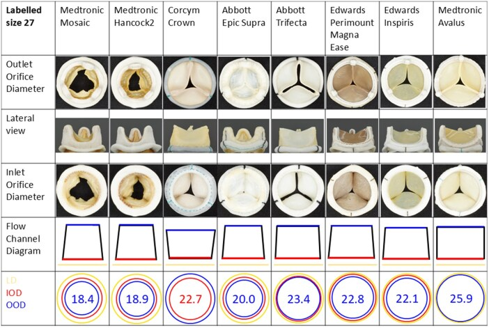
*図60｜**supra-annular型ステント生体弁の各社比較**（27mm表記の各弁の内径/外径・流出側径）｜出典: Astrid Gerritje Maria van Boxtel et al. *Interdisciplinary Cardiovascular and Thoracic Surgery* 2025. doi:10.1093/icvts/ivaf163 [PMC12349921](https://pmc.ncbi.nlm.nih.gov/articles/PMC12349921/)（CC BY）／原図: "Overview of Supra-annular Bioprosthetic Aortic Stented Valves. Overview of different views of supra-annular bioprostheti…"*

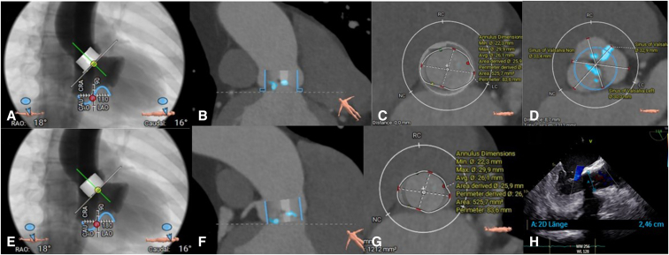
*図61｜**CTベースの人工弁シミュレーション**（25mm弁を有効径25.9mmの弁輪に）｜出典: Miriam Silaschi et al. *JTCVS Techniques* 2024. doi:10.1016/j.xjtc.2024.02.022 [PMC11184518](https://pmc.ncbi.nlm.nih.gov/articles/PMC11184518/)（CC BY-NC-ND）／原図: "Computer tomography based simulation of a 25-mm Inspiris prosthesis (Edwards Lifesciences) inside an aortic annulus with…"*

## 7. 大動脈弁・大動脈基部の解剖（3尖弁）

オペレコの「A弁 3 尖」のシェーマに使える図。用語を正確に区別しておくと図が締まる。

- **VBR（virtual basal ring）** — 3 弁尖の nadir を結ぶ仮想平面。臨床で「弁輪径」と呼ぶのはこれ。
- **VAJ（ventriculo-arterial junction）** — 心室筋と大動脈壁の解剖学的境界。線維性部では VBR と一致するが、筋性部（左・右冠尖側）では乖離し、**myocardial crescent（筋性三日月）**をつくる。
- **FAA（functional aortic annulus）** — VBR から STJ までの、弁を支える機能単位。
- **交連下三角（interleaflet triangle）**
- **接合面** — 各弁尖の lunule（Arantius 結節から交連まで）が重なる領域。effective height (eH) が 9 mm を下回ると prolapse が生じうる。

**AR の機序は El Khoury 分類**で整理する（図 an06）。
Type I＝弁尖運動正常で FAA 拡大または穿孔（Ia: STJ+上行拡大、Ib: 基部拡大、Ic: VBR 拡大、Id: 穿孔）、Type II＝弁尖逸脱、Type III＝弁尖制限。
弁置換のオペレコでも「どの機序の AR だったか」を図示できると術式選択の根拠が明確になる。

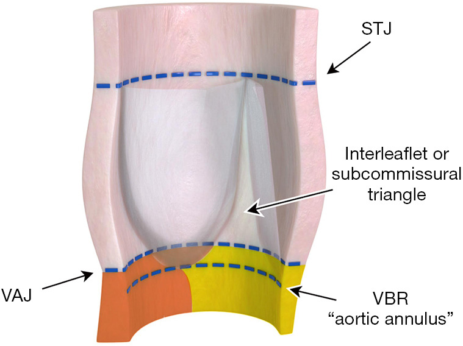
*図62｜**大動脈基部の主要構造**（VAJ／VBR／STJ／弁尖付着線）｜出典: Jama Jahanyar et al. *Annals of Cardiothoracic Surgery* 2024. doi:10.21037/acs-2024-aae-25 [PMC11148763](https://pmc.ncbi.nlm.nih.gov/articles/PMC11148763/)（CC BY-NC-ND）／原図: "This figure depicts the main structures of interest in the aortic root in a simplistic form. It is important to note tha…"*

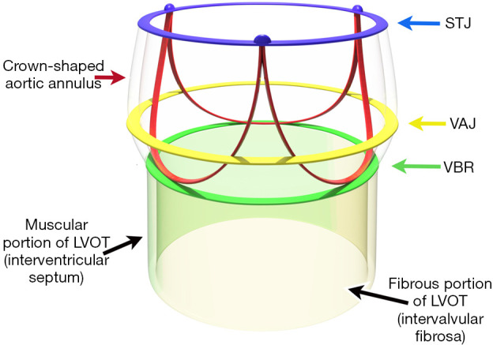
*図63｜**FAA（functional aortic annulus）**：VBRからSTJまでが弁の支持骨格｜出典: Jama Jahanyar et al. *Annals of Cardiothoracic Surgery* 2024. doi:10.21037/acs-2024-aae-25 [PMC11148763](https://pmc.ncbi.nlm.nih.gov/articles/PMC11148763/)（CC BY-NC-ND）／原図: "The FAA represents the necessary support scaffold for the aortic valve. It is the area of the aortic root between the pr…"*

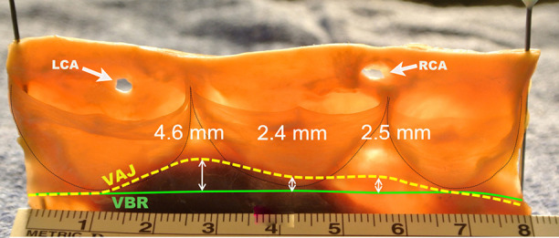
*図64｜**VAJとVBRの違い**：線維性部では一致し、筋性部では乖離する｜出典: Jama Jahanyar et al. *Annals of Cardiothoracic Surgery* 2024. doi:10.21037/acs-2024-aae-25 [PMC11148763](https://pmc.ncbi.nlm.nih.gov/articles/PMC11148763/)（CC BY-NC-ND）／原図: "This anatomical representation demonstrates the difference between the VAJ and VBR. In the fibrous portion of the aortic…"*

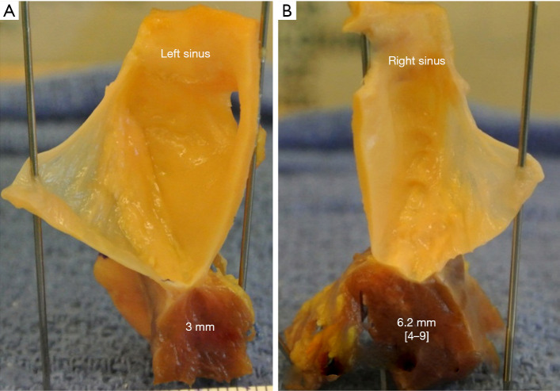
*図65｜**弁輪の厚さの部位差**：後方の僧帽−大動脈線維性連続が最も薄い｜出典: Jama Jahanyar et al. *Annals of Cardiothoracic Surgery* 2024. doi:10.21037/acs-2024-aae-25 [PMC11148763](https://pmc.ncbi.nlm.nih.gov/articles/PMC11148763/)（CC BY-NC-ND）／原図: "The thickness of the aortic annulus varies depending on the area of the LVOT. Posterior in the fibrous portion it is the…"*

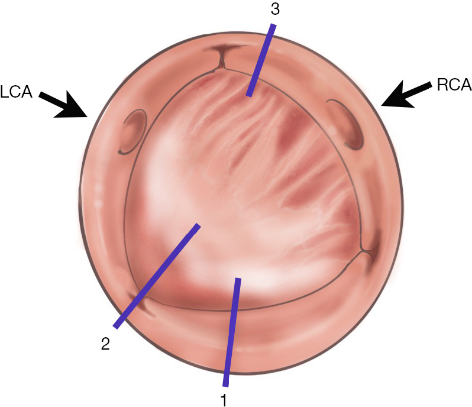
*図66｜**弁輪拡大の切開部位**：1=Nicks、2=Manouguian、3=Konno-Rastan｜出典: Jama Jahanyar et al. *Annals of Cardiothoracic Surgery* 2024. doi:10.21037/acs-2024-aae-25 [PMC11148763](https://pmc.ncbi.nlm.nih.gov/articles/PMC11148763/)（CC BY-NC-ND）／原図: "Depiction of the aortic annulus with areas of interest for annular and root enlargements. Incisions: 1, Nicks; 2, Manoug…"*

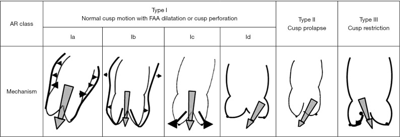
*図67｜**El Khoury分類（AR機序）**：黒矢印＝各セグメントの拡大、灰矢印＝逆流ジェット｜出典: Jama Jahanyar et al. *Annals of Cardiothoracic Surgery* 2023. doi:10.21037/acs-2023-avs1-22 [PMC10248914](https://pmc.ncbi.nlm.nih.gov/articles/PMC10248914/)（CC BY-NC-ND）／原図: "El Khoury classification for AR. Solid black arrows indicate dilation of the respective aortic segment. Grey arrows indi…"*

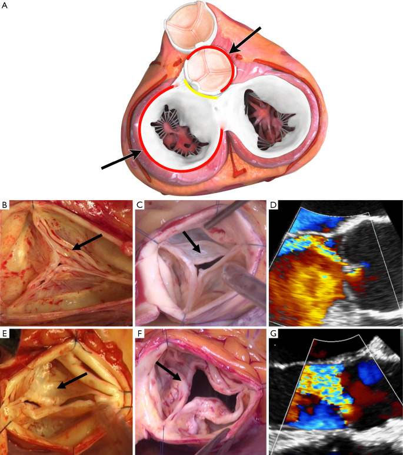
*図68｜**弁輪拡大の好発部位**と、それぞれに対応する逆流ジェット形態（術中所見＋心エコー）｜出典: Jama Jahanyar et al. *Annals of Cardiothoracic Surgery* 2023. doi:10.21037/acs-2023-avs1-22 [PMC10248914](https://pmc.ncbi.nlm.nih.gov/articles/PMC10248914/)（CC BY-NC-ND）／原図: "Areas of the aortic annulus at risk for dilation; intraoperative native valve and echocardiographic images showing respe…"*

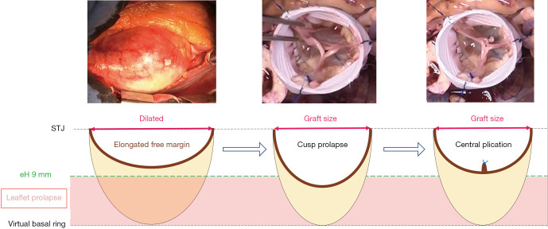
*図69｜**FAA拡大と自由縁長の関係**：effective height <9mmでprolapseが生じうる｜出典: Jama Jahanyar et al. *Annals of Cardiothoracic Surgery* 2023. doi:10.21037/acs-2023-avs1-22 [PMC10248914](https://pmc.ncbi.nlm.nih.gov/articles/PMC10248914/)（CC BY-NC-ND）／原図: "Relationship between dilation of the FAA and free margin length. A prolapse can arise when the eH drops below 9 mm. This…"*

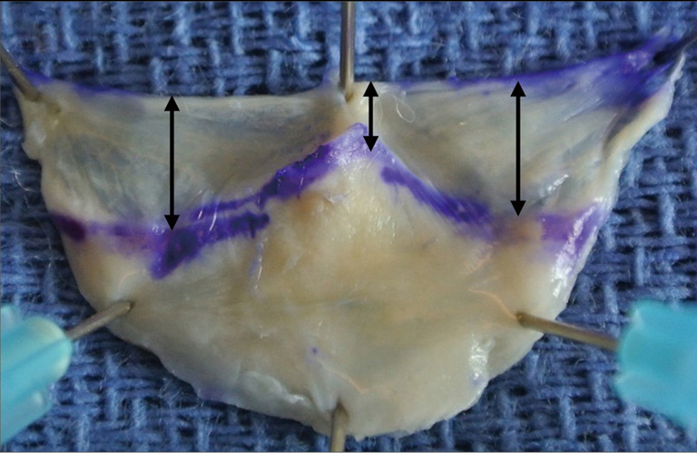
*図70｜**弁尖の接合面**：lunule（Arantius結節から交連まで）と接合高｜出典: Jama Jahanyar et al. *Annals of Cardiothoracic Surgery* 2023. doi:10.21037/acs-2023-avs1-22 [PMC10248914](https://pmc.ncbi.nlm.nih.gov/articles/PMC10248914/)（CC BY-NC-ND）／原図: "Aortic leaflet coaptation surface. The coaptation surface is composed of two adjacent areas called the lunule; each lunu…"*

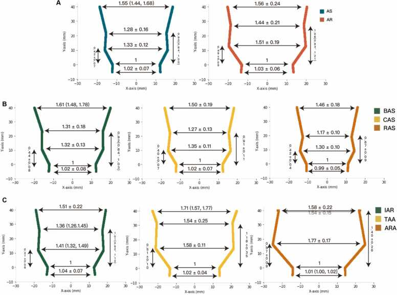
*図71｜**AS と AR における大動脈基部形態の違い**（模式図）｜出典: Yanren Peng et al. *European Journal of Radiology Open* 2023. doi:10.1016/j.ejro.2023.100532 [PMC10661754](https://pmc.ncbi.nlm.nih.gov/articles/PMC10661754/)（CC BY-NC-ND）／原図: "Schematic representation of different aortic valve diseases. (A) Schematic representation of aortic root between AS and …"*

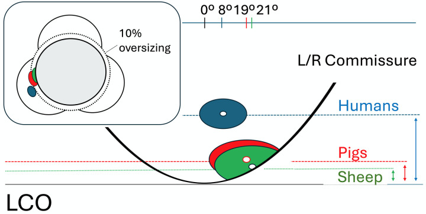
*図72｜**左Valsalva洞と左冠尖付着線の模式図**（冠動脈口高との関係）｜出典: Venessa Strauss et al. *Frontiers in Cardiovascular Medicine* 2025. doi:10.3389/fcvm.2025.1699721 [PMC12777574](https://pmc.ncbi.nlm.nih.gov/articles/PMC12777574/)（CC BY）／原図: "Schematic representation of the left SOV and the insertion line of the left aortic valve cusp. The figure illustrates th…"*

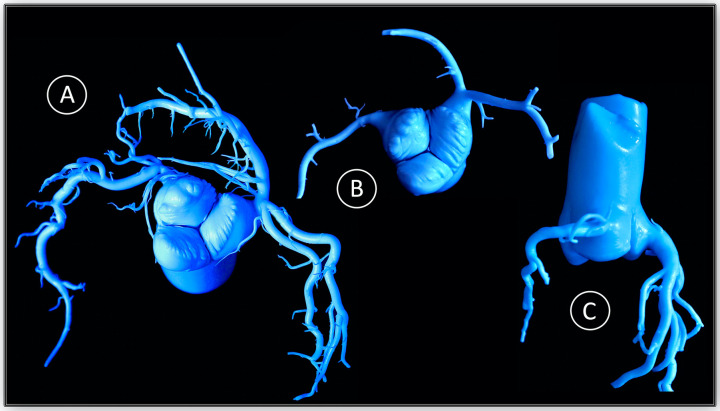
*図73｜**大動脈基部のシリコンキャスト**：弁尖付着(A)、左冠動脈口の偏位(B)、冠動脈口高(C)｜出典: Venessa Strauss et al. *Frontiers in Cardiovascular Medicine* 2025. doi:10.3389/fcvm.2025.1699721 [PMC12777574](https://pmc.ncbi.nlm.nih.gov/articles/PMC12777574/)（CC BY）／原図: "Pressure-controlled silicone-cast of the aortic root of a pig. The leaflet-insertion (A) , the eccentricity of the left …"*

---

## 8. 図表一覧

| # | 図ID | 内容 | 出典 (PMCID) | ライセンス |
|---|---|---|---|---|
| 図1 | `ct01` | 術前CT（軸位断）：上行大動脈が胸骨傍線より右に半周以上露出していればRAT向き。大動脈−胸骨間距離も評価する | [PMC8024826](https://pmc.ncbi.nlm.nih.gov/articles/PMC8024826/) | CC BY-NC-ND |
| 図2 | `ct02` | RAMTに好適なCT所見：上行大動脈が左方偏位していない／第2–3肋間の高さで胸骨右縁から大動脈までが近い | [PMC11619196](https://pmc.ncbi.nlm.nih.gov/articles/PMC11619196/) | CC BY-NC |
| 図3 | `ct03` | 患者・解剖因子のチェックリスト（欠けても禁忌ではないが難度が上がる因子） | [PMC11619196](https://pmc.ncbi.nlm.nih.gov/articles/PMC11619196/) | CC BY-NC |
| 図4 | `ct04` | 術前CT：主肺動脈レベルで上行大動脈が右方に位置する症例が適応 | [PMC9713646](https://pmc.ncbi.nlm.nih.gov/articles/PMC9713646/) | CC BY |
| 図5 | `ct05` | 上行大動脈の位置によるアプローチ選択：RAMT vs J字部分胸骨切開の振り分け | [PMC11565346](https://pmc.ncbi.nlm.nih.gov/articles/PMC11565346/) | CC BY-NC-ND |
| 図6 | `ct06` | MIAVRアプローチ選択の3本柱モデル（解剖・患者因子・術者/施設因子） | [PMC13208154](https://pmc.ncbi.nlm.nih.gov/articles/PMC13208154/) | CC BY |
| 図7 | `ct07` | 術前3D CT：RCA高位起始・石灰化分布。横切開か縦切開かの判断材料 | [PMC12712161](https://pmc.ncbi.nlm.nih.gov/articles/PMC12712161/) | CC BY |
| 図8 | `pos01` | 体位（完全内視鏡下AVR）：右胸を挙上した仰臥位。右上肢の処理と体幹の傾斜角 | [PMC11496183](https://pmc.ncbi.nlm.nih.gov/articles/PMC11496183/) | CC BY |
| 図9 | `pos02` | 体位（側方アクセス・ロボットAVR）：右側を約30°挙上、右腕を下垂 | [PMC12177761](https://pmc.ncbi.nlm.nih.gov/articles/PMC12177761/) | CC BY-NC-ND |
| 図10 | `pos03` | 「槍投げ（spear-throwing）」体位の模式図：右上肢を頭側へ挙上し右前胸〜腋窩を展開 | [PMC10889463](https://pmc.ncbi.nlm.nih.gov/articles/PMC10889463/) | CC BY |
| 図11 | `pos04` | javelin thrower's position（BMI 53.9の実例）：前腋窩線（水平破線）を基準に切開線を設定 | [PMC11546103](https://pmc.ncbi.nlm.nih.gov/articles/PMC11546103/) | CC BY |
| 図12 | `inc01` | RAT：第2肋間（A: 3Dレンダリング、B: 実際の皮切）— MICS AVRの標準的なmain創 | [PMC8024826](https://pmc.ncbi.nlm.nih.gov/articles/PMC8024826/) | CC BY-NC-ND |
| 図13 | `inc02` | 上位右J字部分胸骨切開（J-ministernotomy） | [PMC8024826](https://pmc.ncbi.nlm.nih.gov/articles/PMC8024826/) | CC BY-NC-ND |
| 図14 | `inc03` | 逆V字部分胸骨切開（A: 皮膚マーキング、B: 術野） | [PMC8024826](https://pmc.ncbi.nlm.nih.gov/articles/PMC8024826/) | CC BY-NC-ND |
| 図15 | `inc04` | Right anterior thoracotomy：創の位置と展開の模式図 | [PMC13208154](https://pmc.ncbi.nlm.nih.gov/articles/PMC13208154/) | CC BY |
| 図16 | `inc05` | Ministernotomy（右J字切開）：創の位置と展開の模式図 | [PMC13208154](https://pmc.ncbi.nlm.nih.gov/articles/PMC13208154/) | CC BY |
| 図17 | `inc06` | Transaxillary access：腋窩アプローチの創の位置 | [PMC13208154](https://pmc.ncbi.nlm.nih.gov/articles/PMC13208154/) | CC BY |
| 図18 | `inc07` | 2ポート法の模式図：main創＝第3肋間・鎖骨中線／ポート＝第4肋間・前腋窩線 | [PMC11997802](https://pmc.ncbi.nlm.nih.gov/articles/PMC11997802/) | CC BY |
| 図19 | `inc08` | 完全内視鏡下AVRの4ポート：(1)術野切開 (2)working port (3)内視鏡カメラ (4)Chitwoodクラ… | [PMC12398630](https://pmc.ncbi.nlm.nih.gov/articles/PMC12398630/) | CC BY-NC |
| 図20 | `inc09` | single working port＋3D内視鏡の配置 | [PMC11496183](https://pmc.ncbi.nlm.nih.gov/articles/PMC11496183/) | CC BY |
| 図21 | `inc10` | ランドマークと切開計画：第4肋間をアクセス創とし、ロボットポートは1肋間上下に配置 | [PMC12177761](https://pmc.ncbi.nlm.nih.gov/articles/PMC12177761/) | CC BY-NC-ND |
| 図22 | `inc11` | ロボットポートとアクセス創の位置関係 | [PMC12177761](https://pmc.ncbi.nlm.nih.gov/articles/PMC12177761/) | CC BY-NC-ND |
| 図23 | `inc12` | 術前の切開計画：赤＝カメラポート、青＝切開線／B＝柔軟支持体の生体弁 | [PMC13262695](https://pmc.ncbi.nlm.nih.gov/articles/PMC13262695/) | CC BY-NC-ND |
| 図24 | `inc13` | 2-window ポート配置と弁固定糸の運針経路（白矢印） | [PMC12683039](https://pmc.ncbi.nlm.nih.gov/articles/PMC12683039/) | CC BY |
| 図25 | `inc14` | RAMT第3肋間の術野：soft tissue retractor、3Dカメラポート、Chitwoodクランプ刺入部 | [PMC11084888](https://pmc.ncbi.nlm.nih.gov/articles/PMC11084888/) | CC BY |
| 図26 | `inc15` | 完全胸腔鏡下AVR：(A)創の配置 (B)クランプ後の大動脈基部ベントからの順行性心筋保護 | [PMC11291665](https://pmc.ncbi.nlm.nih.gov/articles/PMC11291665/) | CC BY-NC-ND |
| 図27 | `inc16` | RAMTアクセスと3Dカメラ（video-assisted MICS AVR 100例） | [PMC8010499](https://pmc.ncbi.nlm.nih.gov/articles/PMC8010499/) | CC BY-NC |
| 図28 | `inc17` | 5cm皮切の術中所見と術後の整容性 | [PMC10879061](https://pmc.ncbi.nlm.nih.gov/articles/PMC10879061/) | CC BY |
| 図29 | `inc18` | RAMT AVRの術野セットアップ（左）と術後創（右）（国際多施設研究） | [PMC13059857](https://pmc.ncbi.nlm.nih.gov/articles/PMC13059857/) | CC BY-NC-ND |
| 図30 | `inc19` | MIAVRの術野セットアップ（右前胸壁） | [PMC10989319](https://pmc.ncbi.nlm.nih.gov/articles/PMC10989319/) | CC BY |
| 図31 | `inc20` | 右側方mini-thoracotomy：(A)術野 (B)同一症例の術後皮切 | [PMC11729723](https://pmc.ncbi.nlm.nih.gov/articles/PMC11729723/) | CC BY |
| 図32 | `cp01` | 冠動脈口への直接心筋保護液注入（ministernotomy）— ARでは順行性大動脈基部投与が無効になるため、大動脈切開後… | [PMC8024826](https://pmc.ncbi.nlm.nih.gov/articles/PMC8024826/) | CC BY-NC-ND |
| 図33 | `cp02` | 器具配置：(A)3D内視鏡 (B)Chitwoodクランプ (C)左ベント (D)冠動脈口投与用ダブルカニューレ | [PMC11496183](https://pmc.ncbi.nlm.nih.gov/articles/PMC11496183/) | CC BY |
| 図34 | `cp03` | 上行大動脈直接送血：(A)purse-string (B)カニュレーション（RAT） | [PMC8024826](https://pmc.ncbi.nlm.nih.gov/articles/PMC8024826/) | CC BY-NC-ND |
| 図35 | `cp04` | 着脱式（transthoracic）大動脈クランプ | [PMC8024826](https://pmc.ncbi.nlm.nih.gov/articles/PMC8024826/) | CC BY-NC-ND |
| 図36 | `cp05` | 心膜翻転部レベルの大動脈purse-string | [PMC7918393](https://pmc.ncbi.nlm.nih.gov/articles/PMC7918393/) | CC BY |
| 図37 | `cp06` | 大動脈カニュレーション（術者視野） | [PMC7918393](https://pmc.ncbi.nlm.nih.gov/articles/PMC7918393/) | CC BY |
| 図38 | `cp07` | 静脈カニューレを金属spindleで屈曲させてIVCへ誘導 | [PMC7918393](https://pmc.ncbi.nlm.nih.gov/articles/PMC7918393/) | CC BY |
| 図39 | `cp08` | Chitwood-DeBakeyクランプによる大動脈遮断 | [PMC7918393](https://pmc.ncbi.nlm.nih.gov/articles/PMC7918393/) | CC BY |
| 図40 | `cp09` | 心膜切開（術者視野） | [PMC7918393](https://pmc.ncbi.nlm.nih.gov/articles/PMC7918393/) | CC BY |
| 図41 | `cp10` | 胸壁外へ通した3本の心膜吊り上げ糸 | [PMC7918393](https://pmc.ncbi.nlm.nih.gov/articles/PMC7918393/) | CC BY |
| 図42 | `cp11` | 逆行性心筋保護カニューレ挿入の4-finger法：右手を横隔膜面から後面へ進める | [PMC13200289](https://pmc.ncbi.nlm.nih.gov/articles/PMC13200289/) | CC BY-NC-ND |
| 図43 | `cp12` | 4-finger法の正しい指位置：中指が左房室溝を滑り、薬指と心房壁接合部で接する | [PMC13200289](https://pmc.ncbi.nlm.nih.gov/articles/PMC13200289/) | CC BY-NC-ND |
| 図44 | `cp13` | MECC（低充填量体外循環）とCECCの回路比較 | [PMC11729723](https://pmc.ncbi.nlm.nih.gov/articles/PMC11729723/) | CC BY |
| 図45 | `av01` | 術野セッティング（RAMT・縦切開症例） | [PMC12712161](https://pmc.ncbi.nlm.nih.gov/articles/PMC12712161/) | CC BY |
| 図46 | `av02` | (A)切開部からの大動脈弁視野 (B)弁輪へのnon-everting mattress縫合 (C)閉鎖した切開線 | [PMC12712161](https://pmc.ncbi.nlm.nih.gov/articles/PMC12712161/) | CC BY |
| 図47 | `av03` | TATEGIRI（縦）切開：(a)穿刺部から無冠尖へ縦方向に延長 (b)弁尖切除後の270°弁輪露出 | [PMC12535169](https://pmc.ncbi.nlm.nih.gov/articles/PMC12535169/) | CC BY |
| 図48 | `av04` | 吊り上げ糸による大動脈弁の露出 | [PMC11496183](https://pmc.ncbi.nlm.nih.gov/articles/PMC11496183/) | CC BY |
| 図49 | `av05` | 弁置換の一連：(A)弁切除・デブリードマン (B)サイジング (C)弁輪縫合 (D)生体弁移植 | [PMC11496183](https://pmc.ncbi.nlm.nih.gov/articles/PMC11496183/) | CC BY |
| 図50 | `av06` | 直視下に見た病的大動脈弁（RAMT） | [PMC7918393](https://pmc.ncbi.nlm.nih.gov/articles/PMC7918393/) | CC BY |
| 図51 | `av07` | 3本の連続縫合による人工弁縫着（縫合弁の場合） | [PMC7918393](https://pmc.ncbi.nlm.nih.gov/articles/PMC7918393/) | CC BY |
| 図52 | `av08` | 心臓・大血管の露出（RAMT・中枢送脱血） | [PMC9713646](https://pmc.ncbi.nlm.nih.gov/articles/PMC9713646/) | CC BY |
| 図53 | `av09` | 大動脈切開と人工弁移植 | [PMC9713646](https://pmc.ncbi.nlm.nih.gov/articles/PMC9713646/) | CC BY |
| 図54 | `av10` | (A)縦切開での弁露出 (B)29mm INSPIRISサイザーによるサイジング (C)4本のeverting suture | [PMC12569147](https://pmc.ncbi.nlm.nih.gov/articles/PMC12569147/) | CC BY |
| 図55 | `av11` | RAT創からの術野：大動脈弁と周囲縦隔構造の展開 | [PMC10879061](https://pmc.ncbi.nlm.nih.gov/articles/PMC10879061/) | CC BY |
| 図56 | `av12` | 自動弁輪縫合デバイス（RAM）の展開 | [PMC12683065](https://pmc.ncbi.nlm.nih.gov/articles/PMC12683065/) | CC BY |
| 図57 | `av13` | Cor-Knotの向き（pitfall）：A=推奨（ファスナー辺をValsalva洞側へ） B=逆向きで洞穿孔リスク | [PMC12529675](https://pmc.ncbi.nlm.nih.gov/articles/PMC12529675/) | CC BY |
| 図58 | `av14` | Valsalva洞穿孔（Cor-Knotファスナーによる機械的損傷） | [PMC12529675](https://pmc.ncbi.nlm.nih.gov/articles/PMC12529675/) | CC BY |
| 図59 | `v01` | Avalus生体弁（Medtronic）の写真と模式図 — ウシ心膜弁。PEEK製ステント（金属フリー）、AOA抗石灰化処理 | [PMC5848807](https://pmc.ncbi.nlm.nih.gov/articles/PMC5848807/) | CC BY-NC |
| 図60 | `v02` | supra-annular型ステント生体弁の各社比較（27mm表記の各弁の内径/外径・流出側径） | [PMC12349921](https://pmc.ncbi.nlm.nih.gov/articles/PMC12349921/) | CC BY |
| 図61 | `v03` | CTベースの人工弁シミュレーション（25mm弁を有効径25.9mmの弁輪に） | [PMC11184518](https://pmc.ncbi.nlm.nih.gov/articles/PMC11184518/) | CC BY-NC-ND |
| 図62 | `an01` | 大動脈基部の主要構造（VAJ／VBR／STJ／弁尖付着線） | [PMC11148763](https://pmc.ncbi.nlm.nih.gov/articles/PMC11148763/) | CC BY-NC-ND |
| 図63 | `an02` | FAA（functional aortic annulus）：VBRからSTJまでが弁の支持骨格 | [PMC11148763](https://pmc.ncbi.nlm.nih.gov/articles/PMC11148763/) | CC BY-NC-ND |
| 図64 | `an03` | VAJとVBRの違い：線維性部では一致し、筋性部では乖離する | [PMC11148763](https://pmc.ncbi.nlm.nih.gov/articles/PMC11148763/) | CC BY-NC-ND |
| 図65 | `an04` | 弁輪の厚さの部位差：後方の僧帽−大動脈線維性連続が最も薄い | [PMC11148763](https://pmc.ncbi.nlm.nih.gov/articles/PMC11148763/) | CC BY-NC-ND |
| 図66 | `an05` | 弁輪拡大の切開部位：1=Nicks、2=Manouguian、3=Konno-Rastan | [PMC11148763](https://pmc.ncbi.nlm.nih.gov/articles/PMC11148763/) | CC BY-NC-ND |
| 図67 | `an06` | El Khoury分類（AR機序）：黒矢印＝各セグメントの拡大、灰矢印＝逆流ジェット | [PMC10248914](https://pmc.ncbi.nlm.nih.gov/articles/PMC10248914/) | CC BY-NC-ND |
| 図68 | `an07` | 弁輪拡大の好発部位と、それぞれに対応する逆流ジェット形態（術中所見＋心エコー） | [PMC10248914](https://pmc.ncbi.nlm.nih.gov/articles/PMC10248914/) | CC BY-NC-ND |
| 図69 | `an08` | FAA拡大と自由縁長の関係：effective height <9mmでprolapseが生じうる | [PMC10248914](https://pmc.ncbi.nlm.nih.gov/articles/PMC10248914/) | CC BY-NC-ND |
| 図70 | `an09` | 弁尖の接合面：lunule（Arantius結節から交連まで）と接合高 | [PMC10248914](https://pmc.ncbi.nlm.nih.gov/articles/PMC10248914/) | CC BY-NC-ND |
| 図71 | `an10` | AS と AR における大動脈基部形態の違い（模式図） | [PMC10661754](https://pmc.ncbi.nlm.nih.gov/articles/PMC10661754/) | CC BY-NC-ND |
| 図72 | `an11` | 左Valsalva洞と左冠尖付着線の模式図（冠動脈口高との関係） | [PMC12777574](https://pmc.ncbi.nlm.nih.gov/articles/PMC12777574/) | CC BY |
| 図73 | `an12` | 大動脈基部のシリコンキャスト：弁尖付着(A)、左冠動脈口の偏位(B)、冠動脈口高(C) | [PMC12777574](https://pmc.ncbi.nlm.nih.gov/articles/PMC12777574/) | CC BY |

## 9. 出典文献（図を採用した論文）

1. Robert JM Klautz, A Pieter Kappetein, et al. **Safety, effectiveness and haemodynamic performance of a new stented aortic valve bioprosthesis** *European Journal of Cardio-Thoracic Surgery : Official Journal of the European Association for Cardio-thoracic Surgery* 2017. doi:10.1093/ejcts/ezx066. [PMC5848807](https://pmc.ncbi.nlm.nih.gov/articles/PMC5848807/) — CC BY-NC
2. Ali El-Sayed Ahmad, Saad Salamate, et al. **The First 100 Cases of Two Innovations Combined: Video-Assisted Minimally Invasive Aortic Valve Replacement Through Right Anterior Mini-Thoracotomy Using a Novel Aortic Prosthesis** *Advances in Therapy* 2021. doi:10.1007/s12325-021-01705-x. [PMC8010499](https://pmc.ncbi.nlm.nih.gov/articles/PMC8010499/) — CC BY-NC
3. Gabriele Tamagnini, Raoul Biondi, et al. **Aortic Valve Replacement Via Right Anterior Mini-Thoracotomy: the Conventional Procedure Performed Through a Smaller Incision** *Brazilian Journal of Cardiovascular Surgery* 2021. doi:10.21470/1678-9741-2020-0165. [PMC7918393](https://pmc.ncbi.nlm.nih.gov/articles/PMC7918393/) — CC BY
4. Lorenzo Di Bacco, Antonio Miceli, et al. **Minimally invasive aortic valve surgery** *Journal of Thoracic Disease* 2021. doi:10.21037/jtd-20-1968. [PMC8024826](https://pmc.ncbi.nlm.nih.gov/articles/PMC8024826/) — CC BY-NC-ND
5. Burcin Abud, Onur Saydam, et al. **Outcomes of Aortic Valve Replacement Via Right Anterior Minithoracotomy and Central Cannulation Versus Conventional Aortic Valve Replacement in Obese Patients** *Brazilian Journal of Cardiovascular Surgery* 2022. doi:10.21470/1678-9741-2021-0098. [PMC9713646](https://pmc.ncbi.nlm.nih.gov/articles/PMC9713646/) — CC BY
6. Jama Jahanyar, Peter I Tsai, et al. **Functional and pathomorphological anatomy of the aortic valve and root for aortic valve sparing surgery in tricuspid and bicuspid aortic valves** *Annals of Cardiothoracic Surgery* 2023. doi:10.21037/acs-2023-avs1-22. [PMC10248914](https://pmc.ncbi.nlm.nih.gov/articles/PMC10248914/) — CC BY-NC-ND
7. Yanren Peng, Xiaorong Shu, et al. **Anatomical characteristics of aortic valve diseases: Implications for transcatheter aortic valve replacement** *European Journal of Radiology Open* 2023. doi:10.1016/j.ejro.2023.100532. [PMC10661754](https://pmc.ncbi.nlm.nih.gov/articles/PMC10661754/) — CC BY-NC-ND
8. Rong Hui (Misté) Chia, Pragnesh Joshi. **Sternal sparing aortic valve replacement via right anterior minithoracotomy: An early experience** *Indian Journal of Thoracic and Cardiovascular Surgery* 2023. doi:10.1007/s12055-023-01596-3. [PMC10879061](https://pmc.ncbi.nlm.nih.gov/articles/PMC10879061/) — CC BY
9. Jama Jahanyar, Sameh M Said, et al. **Aortic root anatomy: insights into annular and root enlargement techniques** *Annals of Cardiothoracic Surgery* 2024. doi:10.21037/acs-2024-aae-25. [PMC11148763](https://pmc.ncbi.nlm.nih.gov/articles/PMC11148763/) — CC BY-NC-ND
10. Anas O Kh Abubokha, Rui Li, et al. **Early Outcomes of Minimally Invasive Right Anterior Thoracotomy vs. Median Full Sternotomy in Isolated Aortic Valve Replacement: A Propensity Score Analysis** *Brazilian Journal of Cardiovascular Surgery* 2024. doi:10.21470/1678-9741-2023-0108. [PMC10989319](https://pmc.ncbi.nlm.nih.gov/articles/PMC10989319/) — CC BY
11. Huu Cong Nguyen, Dat Thanh Pham. **Totally 3D endoscopic aortic valve replacement: initial results and experience from a single center** *Frontiers in Cardiovascular Medicine* 2024. doi:10.3389/fcvm.2024.1468452. [PMC11496183](https://pmc.ncbi.nlm.nih.gov/articles/PMC11496183/) — CC BY
12. Ali Fatehi Hassanabad, Melissa A King, et al. **Right Anterior Minithoracotomy Approach for Aortic Valve Replacement** *Innovations (Philadelphia, Pa.)* 2024. doi:10.1177/15569845241276876. [PMC11619196](https://pmc.ncbi.nlm.nih.gov/articles/PMC11619196/) — CC BY-NC
13. Yoshitsugu Nakamura, Taisuke Nakayama, et al. **Benefit of minimally invasive extracorporeal circulation on minimally invasive aortic valve replacement through right lateral mini-thoracotomy using femoral cannulation: a propensity-matched analysis** *Interdisciplinary Cardiovascular and Thoracic Surgery* 2024. doi:10.1093/icvts/ivae224. [PMC11729723](https://pmc.ncbi.nlm.nih.gov/articles/PMC11729723/) — CC BY
14. Miriam Silaschi, André Späth, et al. **Proposal for computer tomography-based valve sizing and prosthesis simulation in endoscopic aortic valve surgery** *JTCVS Techniques* 2024. doi:10.1016/j.xjtc.2024.02.022. [PMC11184518](https://pmc.ncbi.nlm.nih.gov/articles/PMC11184518/) — CC BY-NC-ND
15. Ali Taghizadeh-Waghefi, Asen Petrov, et al. **Minimally Invasive Aortic Valve Replacement for High-Risk Populations: Transaxillary Access Enhances Survival in Patients with Obesity** *Journal of Clinical Medicine* 2024. doi:10.3390/jcm13216529. [PMC11546103](https://pmc.ncbi.nlm.nih.gov/articles/PMC11546103/) — CC BY
16. Marwan Hamiko, Saad Salamate, et al. **Totally Endoscopic Replacement of the Ascending Aorta and the Aortic Root including the Aortic Valve via Right Mini-Thoracotomy: A Multicenter Study** *Journal of Clinical Medicine* 2024. doi:10.3390/jcm13092648. [PMC11084888](https://pmc.ncbi.nlm.nih.gov/articles/PMC11084888/) — CC BY
17. Ali Taghizadeh-Waghefi, Sebastian Arzt, et al. **Right Anterior versus Right Transaxillary Access for Minimally Invasive Aortic Valve Replacement: A Propensity Matched Competitive Analysis** *Journal of Clinical Medicine* 2024. doi:10.3390/jcm13040985. [PMC10889463](https://pmc.ncbi.nlm.nih.gov/articles/PMC10889463/) — CC BY
18. Mi Hee Lim, Chee-Hoon Lee, et al. **Right anterior mini-thoracotomy as first-line strategy for isolated aortic valve replacement: a retrospective study** *Journal of Thoracic Disease* 2024. doi:10.21037/jtd-24-928. [PMC11565346](https://pmc.ncbi.nlm.nih.gov/articles/PMC11565346/) — CC BY-NC-ND
19. Hua Shen, Dong Li, et al. **Comparative efficacy of totally thoracoscopic, mini-thoracotomy, and mini-sternotomy approaches in aortic valve replacement** *Scientific Reports* 2024. doi:10.1038/s41598-024-67018-5. [PMC11291665](https://pmc.ncbi.nlm.nih.gov/articles/PMC11291665/) — CC BY-NC-ND
20. Ghulam Murtaza, Lawrence Wei. **Lateral access fully robotic aortic valve replacement “RAVR”: from novel to normal** *Annals of Cardiothoracic Surgery* 2025. doi:10.21037/acs-2025-ravr-0049. [PMC12177761](https://pmc.ncbi.nlm.nih.gov/articles/PMC12177761/) — CC BY-NC-ND
21. Masaya Nakamizo, Naonori Kawamoto, et al. **Straight Longitudinal Aortotomy for Aortic Valve Replacement Through Right Anterior Minithoracotomy** *Annals of Thoracic Surgery Short Reports* 2025. doi:10.1016/j.atssr.2025.05.011. [PMC12712161](https://pmc.ncbi.nlm.nih.gov/articles/PMC12712161/) — CC BY
22. Hitoki Hashiguchi, Naomi Yasuda, et al. **Totally Endoscopic Aortic Valve Replacement Using a Longitudinal Incision for a Type 0 Bicuspid Aortic Valve: A Case Report** *Cureus* 2025. doi:10.7759/cureus.93050. [PMC12569147](https://pmc.ncbi.nlm.nih.gov/articles/PMC12569147/) — CC BY
23. Venessa Strauss, Harish Appa, et al. **A difference that matters: the aortic root anatomy of large animal models vs. humans** *Frontiers in Cardiovascular Medicine* 2025. doi:10.3389/fcvm.2025.1699721. [PMC12777574](https://pmc.ncbi.nlm.nih.gov/articles/PMC12777574/) — CC BY
24. Gianpiero Buttiglione, Can Gollmann-Tepeköylü, et al. **Totally Endoscopic Aortic Valve Replacement With Triangulated Suturing: How to Do It** *Innovations (Philadelphia, Pa.)* 2025. doi:10.1177/15569845251344614. [PMC12398630](https://pmc.ncbi.nlm.nih.gov/articles/PMC12398630/) — CC BY-NC
25. Sahri Kim, Jae Suk Yoo. **Totally endoscopic aortic valve replacement with concomitant septal myectomy** *Interdisciplinary Cardiovascular and Thoracic Surgery* 2025. doi:10.1093/icvts/ivaf030. [PMC11997802](https://pmc.ncbi.nlm.nih.gov/articles/PMC11997802/) — CC BY
26. Astrid Gerritje Maria van Boxtel, Tjark Ebels. **The Outlet Orifice Diameter of Surgical Bioprosthetic Aortic Stented Valves Is Predominantly Much Smaller Than the Inlet Orifice Diameter** *Interdisciplinary Cardiovascular and Thoracic Surgery* 2025. doi:10.1093/icvts/ivaf163. [PMC12349921](https://pmc.ncbi.nlm.nih.gov/articles/PMC12349921/) — CC BY
27. Ali Fatehi Hassanabad, Mortaza Fatehi Hassanabad, et al. **Right anterior mini-thoracotomy for isolated aortic valve replacement: An international and multicenter study** *JTCVS Open* 2025. doi:10.1016/j.xjon.2025.101553. [PMC13059857](https://pmc.ncbi.nlm.nih.gov/articles/PMC13059857/) — CC BY-NC-ND
28. Saad Salamate, Ali El-Sayed Ahmad, et al. **Automated annular suture device versus conventional annular suture technique in endoscopic aortic valve replacement: A propensity score–matched analysis** *JTCVS Techniques* 2025. doi:10.1016/j.xjtc.2025.09.034. [PMC12683065](https://pmc.ncbi.nlm.nih.gov/articles/PMC12683065/) — CC BY
29. Akitoshi Yamada, Chihiro Okubo, et al. **Totally 3-dimensional endoscopic aortic valve replacement for situs inversus totalis using a 2-window port configuration** *JTCVS Techniques* 2025. doi:10.1016/j.xjtc.2025.09.019. [PMC12683039](https://pmc.ncbi.nlm.nih.gov/articles/PMC12683039/) — CC BY
30. Akitoshi Yamada, Chihiro Okubo, et al. **Valsalva sinus perforation caused by Cor-Knot during totally endoscopic minimally invasive aortic valve replacement** *JTCVS Techniques* 2025. doi:10.1016/j.xjtc.2025.06.020. [PMC12529675](https://pmc.ncbi.nlm.nih.gov/articles/PMC12529675/) — CC BY
31. Hitoki Hashiguchi, Naomi Yasuda, et al. **The TATEGIRI technique: adaptation of a longitudinal aortotomy for totally endoscopic aortic valve replacement** *Journal of Cardiothoracic Surgery* 2025. doi:10.1186/s13019-025-03613-5. [PMC12535169](https://pmc.ncbi.nlm.nih.gov/articles/PMC12535169/) — CC BY
32. Paweł Czub, Krzysztof Wróbel, et al. **Endoscopic implantation of an aortic valve prosthesis with a flexible support frame** *Cardiology Journal* 2026. doi:10.5603/cj.106564. [PMC13262695](https://pmc.ncbi.nlm.nih.gov/articles/PMC13262695/) — CC BY-NC-ND
33. Walid Hammad. **4-finger technique for retrograde cardioplegia cannula insertion** *Journal of Cardiothoracic Surgery* 2026. doi:10.1186/s13019-026-04230-6. [PMC13200289](https://pmc.ncbi.nlm.nih.gov/articles/PMC13200289/) — CC BY-NC-ND
34. Adam R Kowalówka, Mikołaj Jodłowski, et al. **Minimally Invasive Aortic Valve Surgery: State-of-the-Art Review of Transaxillary, Thoracotomy, and Ministernotomy Approaches** *Life* 2026. doi:10.3390/life16050777. [PMC13208154](https://pmc.ncbi.nlm.nih.gov/articles/PMC13208154/) — CC BY

## 10. 図は無いが AR × MICS AVR で必読の文献

PMC で全文は読めるが CC ライセンスが確認できず、図を転載していないもの。リンク先で図を確認できる。

- Ito J, Nakanaga H, Fujii H, Tabata M. **Endoscopically assisted selective antegrade cardioplegia in minimally invasive aortic valve replacement for patients with aortic insufficiency.** *JTCVS Tech* 2023;18:28-36. doi:10.1016/j.xjtc.2023.01.002. [PMC10122126](https://pmc.ncbi.nlm.nih.gov/articles/PMC10122126/)  
  → AR に対する MICS AVR の心筋保護の決定版。104 例。内視鏡下 selective ostial cardioplegia の手順が step-by-step で図示されている
- Sato S, Azami T, Kawamoto T, et al. **Safety and Applicability of Continuous Retrograde Cardioplegia in Minimally Invasive Aortic Valve Replacement: New Approaches.** *Ann Thorac Cardiovasc Surg* 2022;28:36-40. doi:10.5761/atcs.nm.20-00293. [PMC8915936](https://pmc.ncbi.nlm.nih.gov/articles/PMC8915936/)  
  → 持続冷血逆行性心筋保護（700 mL/h）による MICS-AVR 9 例
- Jung EY, Im JE, Min HK, Lee SS. **Aortic valve replacement through right anterior mini-thoracotomy in patients with chronic severe aortic regurgitation.** *J Yeungnam Med Sci* 2024;41:213-219. doi:10.12701/jyms.2024.00290. [PMC11294798](https://pmc.ncbi.nlm.nih.gov/articles/PMC11294798/)  
  → 慢性重症 AR に限定した RAT-AVR の連続 8 例。AR 単独を扱った数少ない報告
- Lamelas J. **Minimally invasive aortic valve replacement: the "Miami Method".** *Ann Cardiothorac Surg* 2015;4:71-77. doi:10.3978/j.issn.2225-319X.2014.12.10. [PMC4311159](https://pmc.ncbi.nlm.nih.gov/articles/PMC4311159/)  
  → MICS AVR の古典的手技論文。術野写真 12 点（PMC で全文閲覧可）
- Glauber M, Ferrarini M, Miceli A. **Minimally invasive aortic valve surgery: state of the art and future directions.** *Ann Cardiothorac Surg* 2015;4:26-32. doi:10.3978/j.issn.2225-319X.2014.06.03. [PMC4384243](https://pmc.ncbi.nlm.nih.gov/articles/PMC4384243/)  
  → MIAVR 総説
- Vola M, Fuzellier JF, Campisi S, et al. **Technical points for aortic valve replacement through right anterior minithoracotomy.** *Eur J Cardiothorac Surg* 2018;54:194. doi:10.1093/ejcts/ezy105.  
  → RAT-AVR の technical points
- Malvindi PG, et al. **Minimally invasive aortic valve replacement through a right anterior thoracotomy.** *Multimed Man Cardiothorac Surg* 2024. doi:10.1510/mmcts.2024.041.  
  → MMCTS の手技動画（非 OA）

---

## 著作権について

収載した図はすべて各出版社・著者が保持する著作権物であり、PMC Open Access Subset において CC BY / CC BY-NC / CC BY-NC-ND のいずれかで公開されているものに限って引用している。各図のキャプションに原典・DOI・PMCID・ライセンスを明示した。**個人の学習・診療の参考目的での利用に限る。** 再配布・商用利用・改変は各ライセンスの条件に従うこと（NC 付きは商用不可、ND 付きは改変版の配布不可）。
